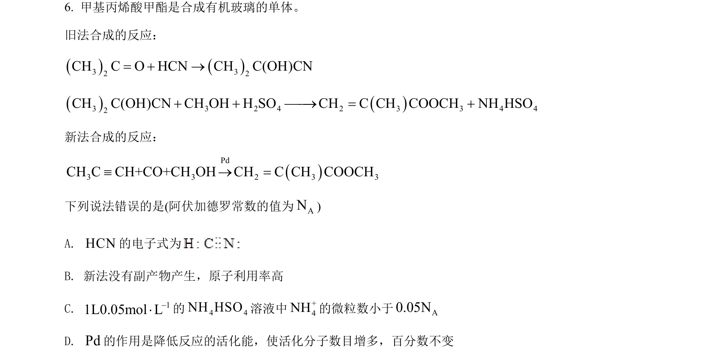
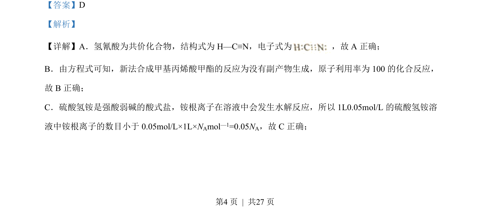
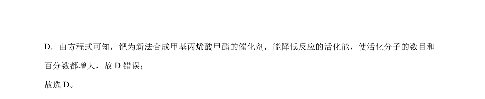

## 题面

## 摘要

考查化学用语正误判断，涉及电子式、原子利用率、盐类水解及催化剂对活化能影响

## 关联考点

- [[266-电子式|电子式]]
- [[992-原子利用率|原子利用率]]
- [[336-盐类水解|盐类水解]]
- [[351-活化能|活化能]]

## 答案与解析

> 📄 原 PDF 第 4 页：`素材/真题/湖南/2008-2024·（湖南）化学高考真题/2022年高考化学试卷（湖南）（解析卷）.pdf`
