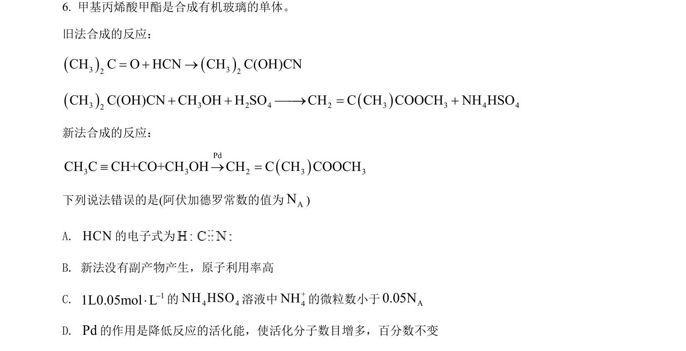
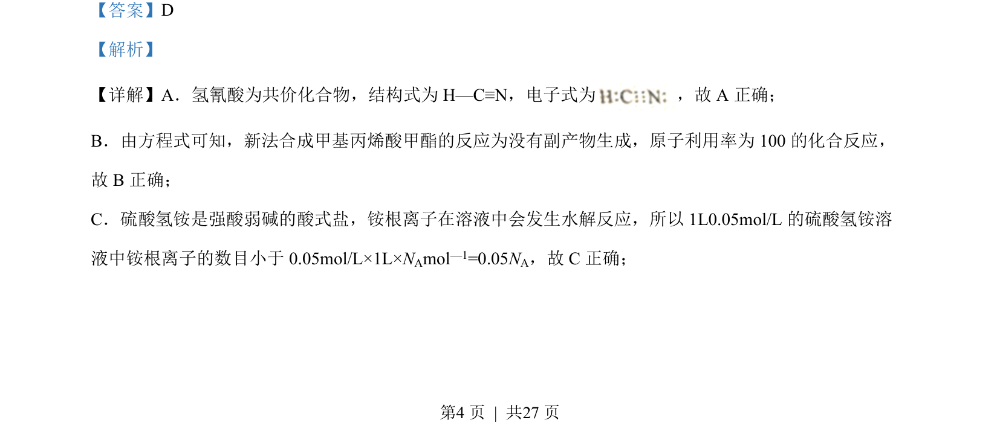
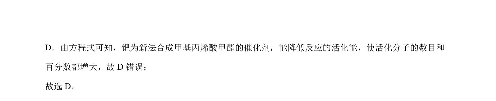

## 题面

## 摘要

考查化学用语正误判断，涉及电子式、原子利用率、盐类水解及催化剂对活化能影响

## 关联考点

- [[266-电子式|电子式]]
- [[992-原子利用率|原子利用率]]
- [[336-盐类水解|盐类水解]]
- [[351-活化能|活化能]]

## 答案与解析

> 📄 原 PDF 第 4 页：`素材/真题/湖南/2008-2024·（湖南）化学高考真题/2022年高考化学试卷（湖南）（解析卷）.pdf`

<!-- 题干文本-start -->
## 题干文本
6. 甲基丙烯酸甲酯是合成有机玻璃的单体。
旧法合成的反应：
3 32 2CH C O HCN CH C(OH)CN= + ®3 3 2 4 2 3 3 4 42CH C(OH)CN CH OH H SO CH C CH COOCH NH HSO¾¾ ® =+ + +
新法合成的反应：
Pd3 3 2 3 3CH C CH+CO+CH OH CH C CH COOCHº ® =
下列说法错误的是(阿伏加德罗常数的值为AN)
A. HCN的电子式为
B. 新法没有副产物产生，原子利用率高
C. 11L0.05mol L-×的4 4NH HSO溶液中+4NH的微粒数小于 A0.05N
D. Pd的作用是降低反应的活化能，使活化分子数目增多，百分数不变
<!-- 题干文本-end -->

<!-- 解析文本-start -->
## 解析文本
【答案】D
【解析】
【详解】A．氢氰酸为共价化合物，结构式为 H—C≡N，电子式为 ，故 A 正确；
B．由方程式可知，新法合成甲基丙烯酸甲酯的反应为没有副产物生成，原子利用率为 100 的化合反应，
故 B正确；
C．硫酸氢铵是强酸弱碱的酸式盐，铵根离子在溶液中会发生水解反应，所以 1L0.05mol/L的硫酸氢铵溶
液中铵根离子的数目小于 0.05mol/L×1L×NAmol—1=0.05NA，故 C正确；
<!-- 解析文本-end -->
