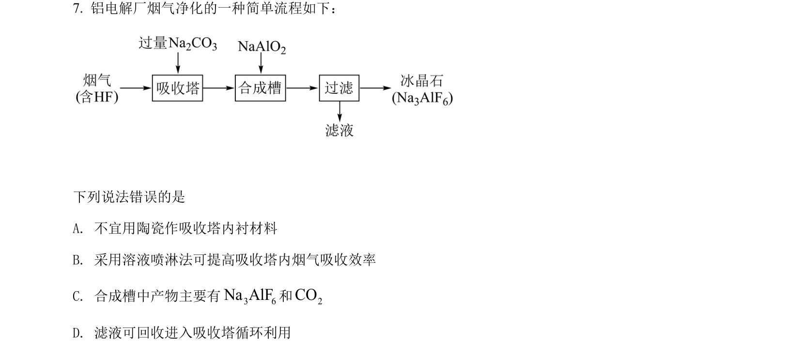
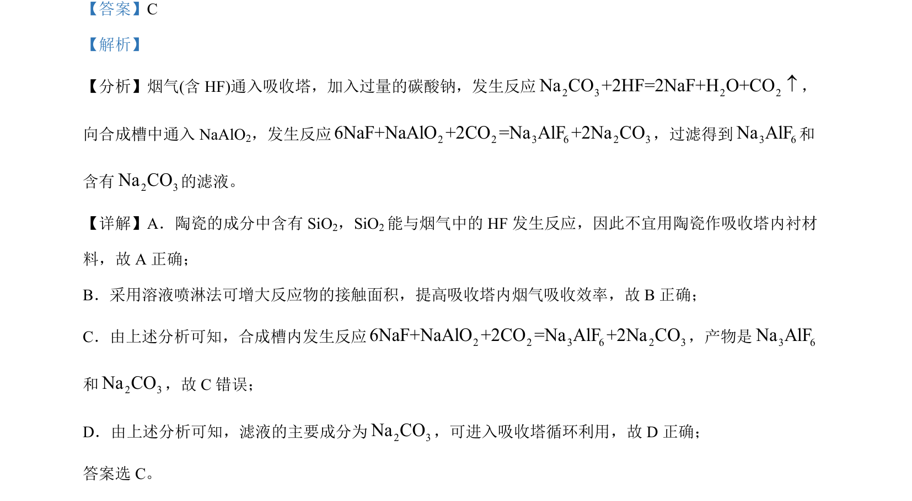

## 题面

## 摘要

Na2CO3吸收HF制备Na3AlF6的工艺流程分析，判断设备材料、操作、反应产物及循环利用的正误

## 关联考点

- [[SiO2与HF反应]]
- [[反应接触面积与吸收效率]]
- [[复分解反应产物判断]]
- [[滤液循环利用]]

## 答案与解析

> 📄 原 PDF 第 5 页：`素材/真题/湖南/2008-2024·（湖南）化学高考真题/2022年高考化学试卷（湖南）（解析卷）.pdf`
