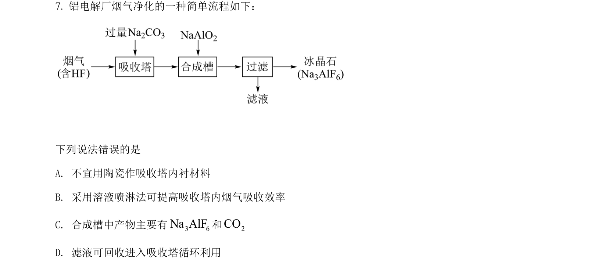
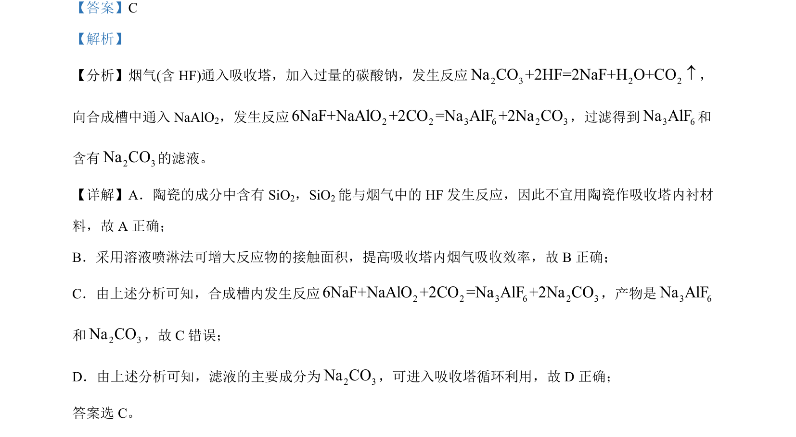

## 题面

## 摘要

Na2CO3吸收HF制备Na3AlF6的工艺流程分析，判断设备材料、操作、反应产物及循环利用的正误

## 关联考点

- [[SiO2与HF反应]]
- [[反应接触面积与吸收效率]]
- [[复分解反应产物判断]]
- [[滤液循环利用]]

## 答案与解析

> 📄 原 PDF 第 5 页：`素材/真题/湖南/2008-2024·（湖南）化学高考真题/2022年高考化学试卷（湖南）（解析卷）.pdf`

<!-- 题干文本-start -->
## 题干文本
7. 铝电解厂烟气净化的一种简单流程如下：
下列说法错误的是
A. 不宜用陶瓷作吸收塔内衬材料
B. 采用溶液喷淋法可提高吸收塔内烟气吸收效率
C. 合成槽中产物主要有3 6Na AlF和2CO
D. 滤液可回收进入吸收塔循环利用
<!-- 题干文本-end -->

<!-- 解析文本-start -->
## 解析文本
【答案】C
【解析】
【分析】烟气(含 HF)通入吸收塔，加入过量的碳酸钠，发生反应2 3 2 2Na CO +2HF=2NaF+H O+CO­，
向合成槽中通入 NaAlO2，发生反应 2 2 3 6 2 36NaF+NaAlO +2CO =Na AlF +2Na CO，过滤得到3 6Na AlF和
含有2 3Na CO的滤液。
【详解】A．陶瓷的成分中含有 SiO2，SiO2能与烟气中的 HF 发生反应，因此不宜用陶瓷作吸收塔内衬材
料，故 A 正确；
B．采用溶液喷淋法可增大反应物的接触面积，提高吸收塔内烟气吸收效率，故 B正确；
C．由上述分析可知，合成槽内发生反应 2 2 3 6 2 36NaF+NaAlO +2CO =Na AlF +2Na CO，产物是3 6Na AlF
和2 3Na CO，故 C错误；
D．由上述分析可知，滤液的主要成分为2 3Na CO，可进入吸收塔循环利用，故 D 正确；
答案选 C。
<!-- 解析文本-end -->
