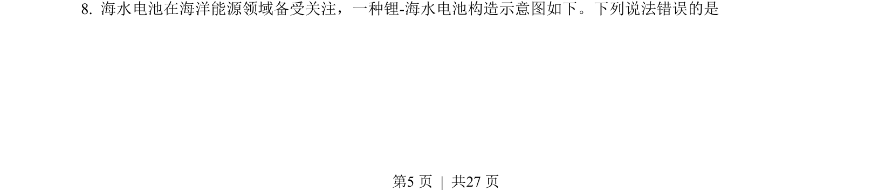
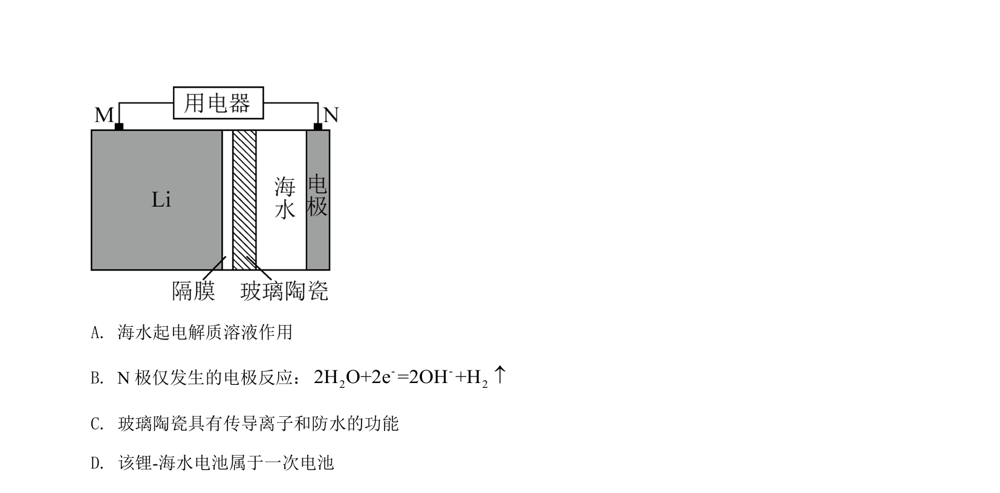
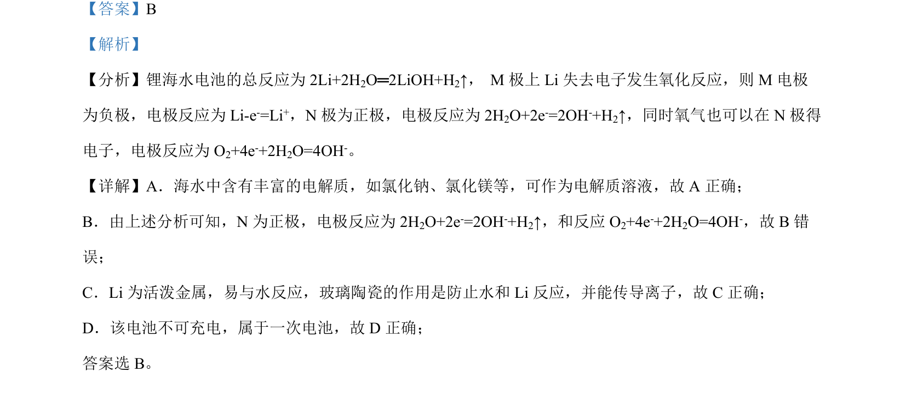

## 题面

## 摘要

锂海水电池以海水为电解质，Li作负极发生氧化反应，N正极可发生H₂O和O₂的还原，属一次电池。

## 关联考点

- [[原电池电极判断]]
- [[794-电极反应式|电极反应式]]
- [[361-一次电池|一次电池]]
- [[167-电解质|电解质]]

## 答案与解析

> 📄 原 PDF 第 5 页：`素材/真题/湖南/2008-2024·（湖南）化学高考真题/2022年高考化学试卷（湖南）（解析卷）.pdf`
