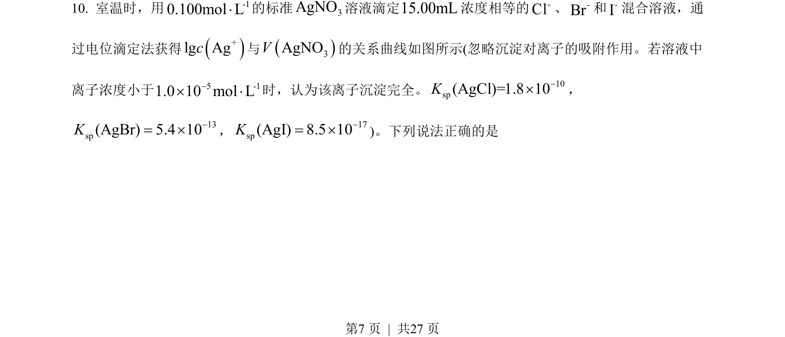
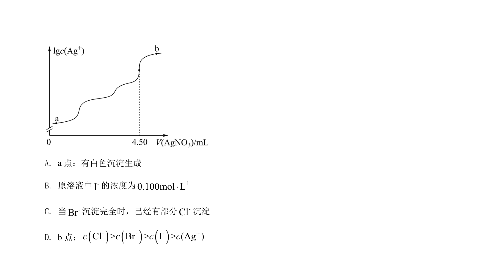
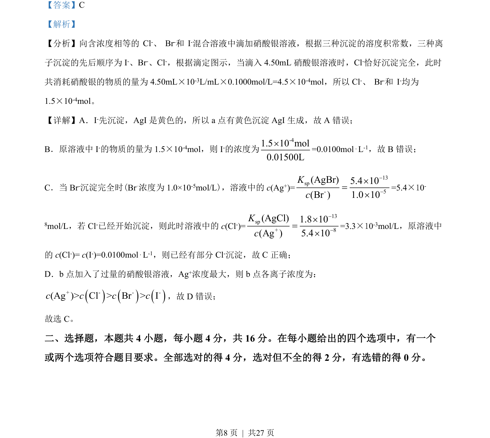

## 题面

## 摘要

本题考查分步沉淀及溶度积常数的计算与应用，根据AgX的Ksp判断离子沉淀顺序及浓度变化。

## 关联考点

- [[762-溶度积|溶度积常数]]
- [[分步沉淀]]
- [[810-离子浓度计算|离子浓度计算]]
- [[328-沉淀溶解平衡|沉淀溶解平衡]]

## 答案与解析

> 📄 原 PDF 第 7 页：`素材/真题/湖南/2008-2024·（湖南）化学高考真题/2022年高考化学试卷（湖南）（解析卷）.pdf`
