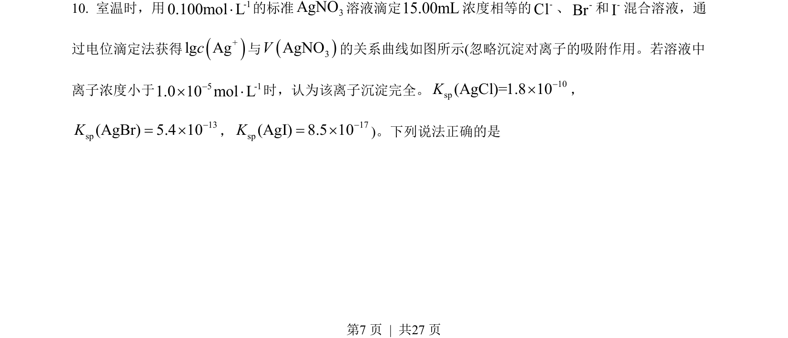
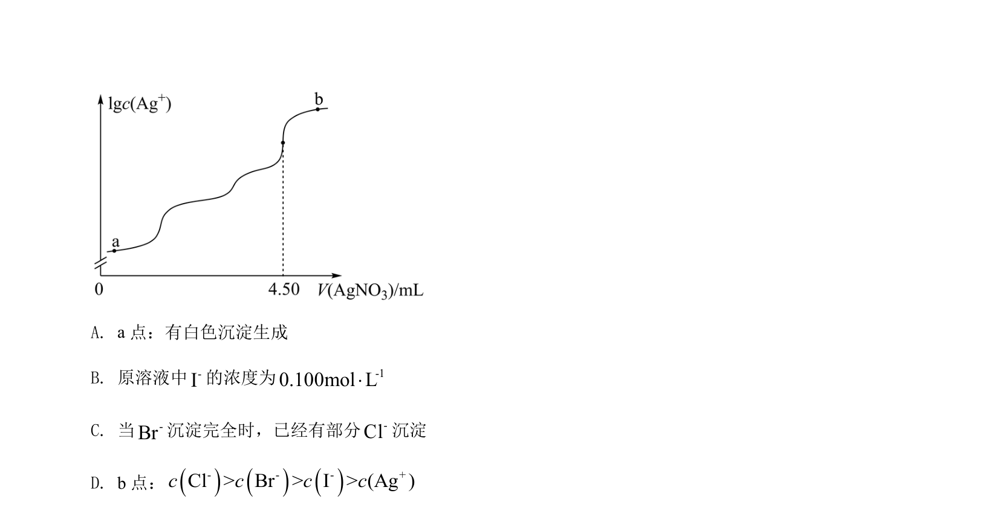
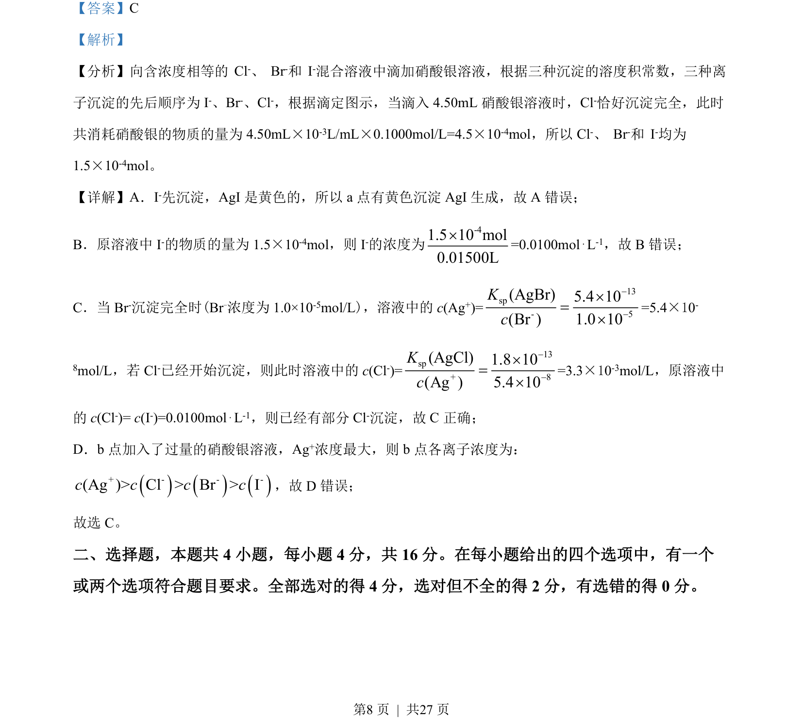

## 题面

## 摘要

本题考查分步沉淀及溶度积常数的计算与应用，根据AgX的Ksp判断离子沉淀顺序及浓度变化。

## 关联考点

- [[762-溶度积|溶度积常数]]
- [[分步沉淀]]
- [[810-离子浓度计算|离子浓度计算]]
- [[328-沉淀溶解平衡|沉淀溶解平衡]]

## 答案与解析

> 📄 原 PDF 第 7 页：`素材/真题/湖南/2008-2024·（湖南）化学高考真题/2022年高考化学试卷（湖南）（解析卷）.pdf`

<!-- 题干文本-start -->
## 题干文本
10. 室温时，用 -10.100mol L×的标准 3AgNO溶液滴定15.00mL浓度相等的-Cl、-Br和-I混合溶液，通
过电位滴定法获得+lg Agc与3AgNOV的关系曲线如图所示(忽略沉淀对离子的吸附作用。若溶液中
离子浓度小于 5 -11.0 10 mol L-´ ×时，认为该离子沉淀完全。 10sp(AgCl)=1.8 10K-´，
13sp(AgBr) 5.4 10K-= ´， 17sp(AgI) 8.5 10K-= ´)。下列说法正确的是
<!-- 题干文本-end -->

<!-- 解析文本-start -->
## 解析文本

<!-- 解析文本-end -->
