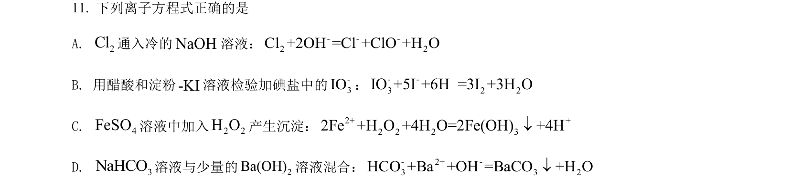
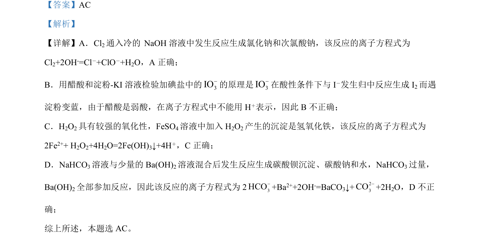

## 题面

## 摘要

考查离子方程式正误判断，涉及氯气与碱反应、醋酸弱酸性质、过氧化氢氧化性及碳酸氢盐反应。

## 关联考点

- [[907-离子方程式书写与正误判断|离子方程式正误判断]]
- [[162-氧化还原反应|氧化还原反应]]
- [[157-弱电解质|弱电解质]]
- [[氯及其化合物]]
- [[964-铁及其化合物|铁及其化合物]]

## 答案与解析

> 📄 原 PDF 第 9 页：`素材/真题/湖南/2008-2024·（湖南）化学高考真题/2022年高考化学试卷（湖南）（解析卷）.pdf`
