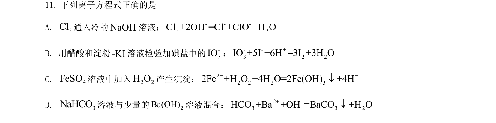
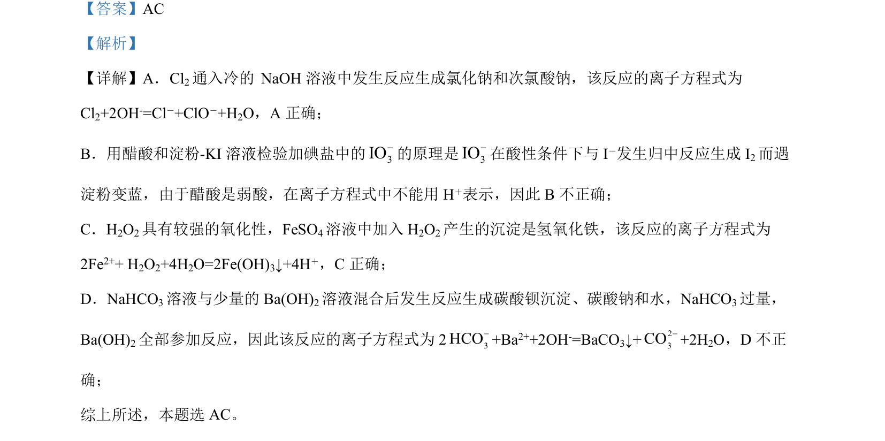

## 题面

## 摘要

考查离子方程式正误判断，涉及氯气与碱反应、醋酸弱酸性质、过氧化氢氧化性及碳酸氢盐反应。

## 关联考点

- [[907-离子方程式书写与正误判断|离子方程式正误判断]]
- [[162-氧化还原反应|氧化还原反应]]
- [[157-弱电解质|弱电解质]]
- [[氯及其化合物]]
- [[964-铁及其化合物|铁及其化合物]]

## 答案与解析

> 📄 原 PDF 第 9 页：`素材/真题/湖南/2008-2024·（湖南）化学高考真题/2022年高考化学试卷（湖南）（解析卷）.pdf`

<!-- 题干文本-start -->
## 题干文本
11. 下列离子方程式正确的是
A. 2Cl通入冷的NaOH溶液： - - -2 2Cl +2OH =Cl +ClO +H O
B. 用醋酸和淀粉-KI溶液检验加碘盐中的-3IO：- - +3 2 2O +5I +6H =3I +3H OI
C. 4FeSO溶液中加入2 2H O产生沉淀： +2+2 2 2 32Fe +H O +4H O=2Fe(OH) +4H¯
D. 3NaHCO溶液与少量的 2Ba(OH)溶液混合：- 2+ -3 3 2HCO +Ba +OH BaCO +H O=¯
<!-- 题干文本-end -->

<!-- 解析文本-start -->
## 解析文本
【答案】AC
【解析】
【详解】A．Cl2通入冷的 NaOH 溶液中发生反应生成氯化钠和次氯酸钠，该反应的离子方程式为
Cl2+2OH-=Cl－+ClO－+H2O，A 正确；
B．用醋酸和淀粉-KI 溶液检验加碘盐中的3IO-的原理是3IO-在酸性条件下与 I－发生归中反应生成 I2而遇
淀粉变蓝，由于醋酸是弱酸，在离子方程式中不能用 H＋表示，因此 B不正确；
C．H2O2具有较强的氧化性，FeSO4溶液中加入 H2O2产生的沉淀是氢氧化铁，该反应的离子方程式为
2Fe2++ H2O2+4H2O=2Fe(OH)3↓+4H＋，C正确；
D．NaHCO3溶液与少量的 Ba(OH)2溶液混合后发生反应生成碳酸钡沉淀、碳酸钠和水，NaHCO3过量，
Ba(OH)2全部参加反应，因此该反应的离子方程式为 2 3HCO-+Ba2++2OH-=BaCO3↓+23CO-+2H2O，D 不正
确；
综上所述，本题选 AC。
<!-- 解析文本-end -->
