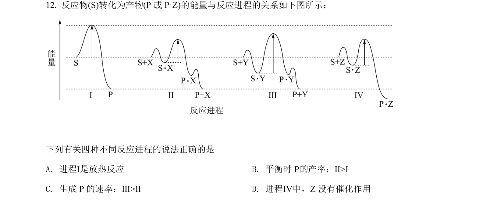
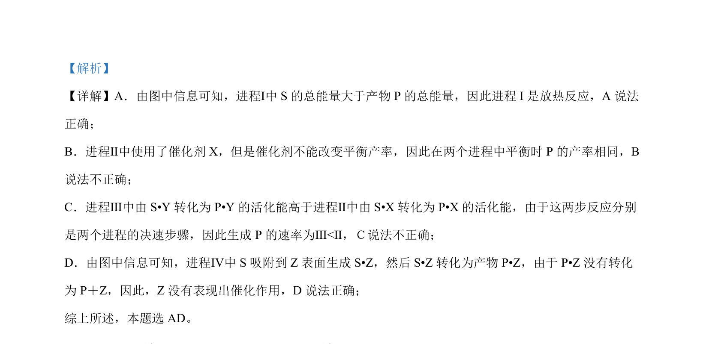

## 题面

## 摘要

该题结合反应进程能量图判断反应热效应、催化剂作用及活化能比较，并通过 Fe³⁺ 与 SO₃²⁻ 的实验分析水解与还原反应的相互影响。

## 关联考点

- [[反应热效应]]
- [[351-活化能|活化能]]
- [[039-催化剂|催化剂]]
- [[336-盐类水解|盐类水解]]
- [[162-氧化还原反应|氧化还原反应]]

## 答案与解析

> 📄 原 PDF 第 9 页：`素材/真题/湖南/2008-2024·（湖南）化学高考真题/2022年高考化学试卷（湖南）（解析卷）.pdf`
