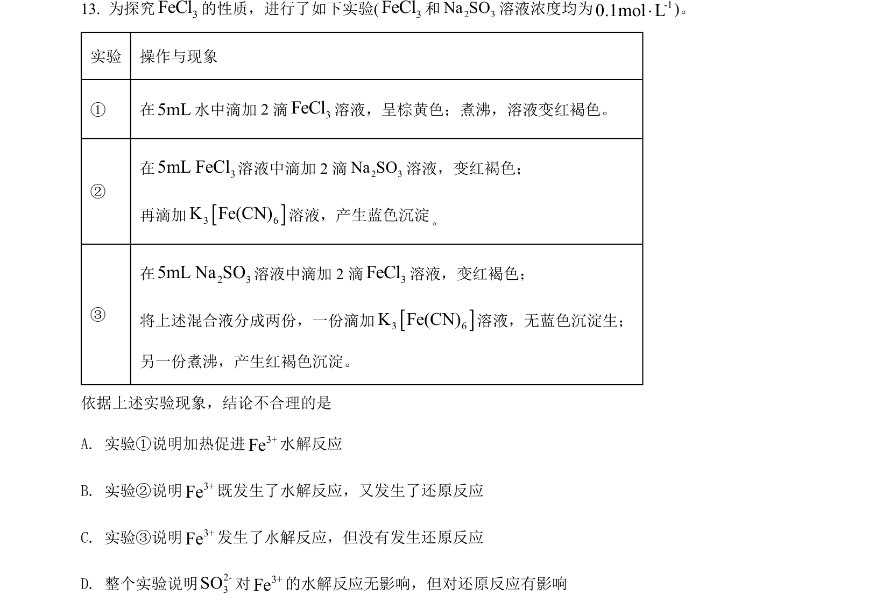
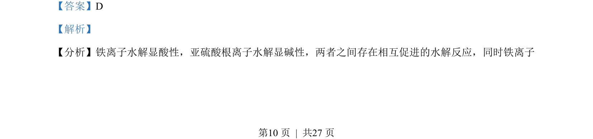
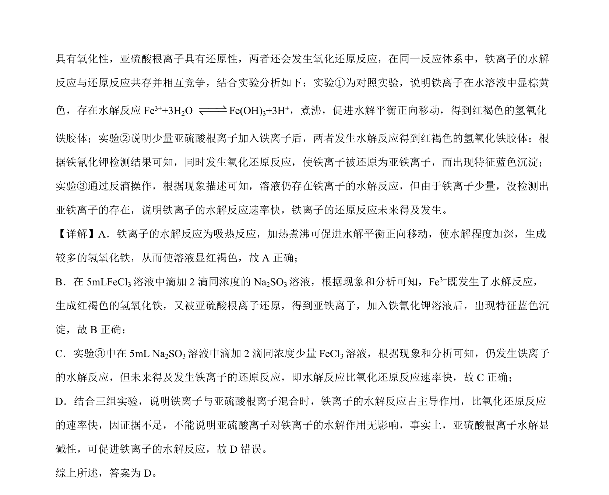

## 题面

## 摘要

本题通过对比实验探究Fe³⁺与SO₃²⁻混合时水解反应和氧化还原反应的竞争关系。

## 关联考点

- [[Fe3+水解]]
- [[SO32-还原性]]
- [[162-氧化还原反应|氧化还原反应]]
- [[水解与氧化还原竞争]]

## 答案与解析

> 📄 原 PDF 第 10 页：`素材/真题/湖南/2008-2024·（湖南）化学高考真题/2022年高考化学试卷（湖南）（解析卷）.pdf`
