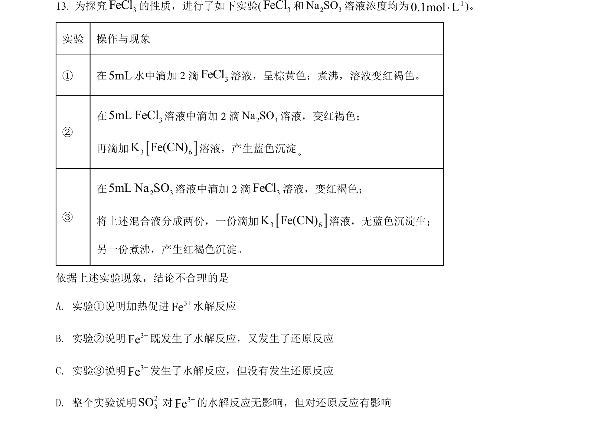
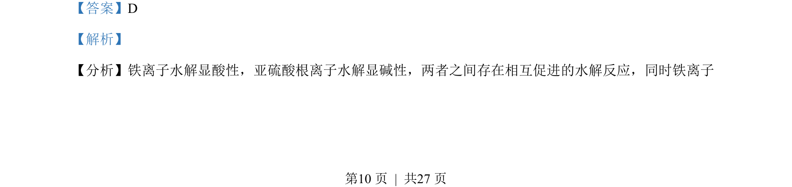
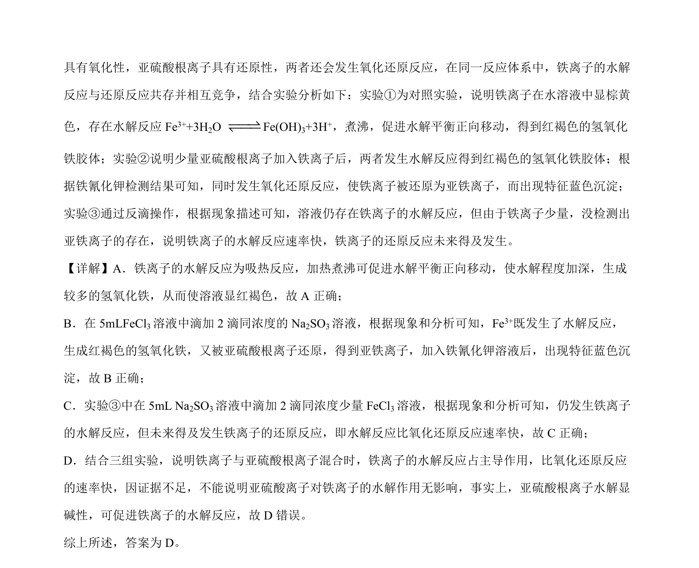

## 题面

## 摘要

本题通过对比实验探究Fe³⁺与SO₃²⁻混合时水解反应和氧化还原反应的竞争关系。

## 关联考点

- [[Fe3+水解]]
- [[SO32-还原性]]
- [[162-氧化还原反应|氧化还原反应]]
- [[水解与氧化还原竞争]]

## 答案与解析

> 📄 原 PDF 第 10 页：`素材/真题/湖南/2008-2024·（湖南）化学高考真题/2022年高考化学试卷（湖南）（解析卷）.pdf`

<!-- 题干文本-start -->
## 题干文本
13. 为探究3FeCl的性质，进行了如下实验(3FeCl和2 3Na SO溶液浓度均为 -10.1mol L×)。
实验 操作与现象
① 在5mL水中滴加 2 滴3FeCl溶液，呈棕黄色；煮沸，溶液变红褐色。
②
在 35mL FeCl溶液中滴加 2滴2 3Na SO溶液，变红褐色；
再滴加3 6K Fe(CN)溶液，产生蓝色沉淀
③
在 2 35mL Na SO溶液中滴加 2 滴3FeCl溶液，变红褐色；
将上述混合液分成两份，一份滴加3 6K Fe(CN)溶液，无蓝色沉淀生；
另一份煮沸，产生红褐色沉淀。
依据上述实验现象，结论不合理的是
A. 实验①说明加热促进3+Fe水解反应
B. 实验②说明3+Fe既发生了水解反应，又发生了还原反应
C. 实验③说明3+Fe发生了水解反应，但没有发生还原反应
D. 整个实验说明2-3SO对3+Fe的水解反应无影响，但对还原反应有影响
<!-- 题干文本-end -->

<!-- 解析文本-start -->
## 解析文本
【答案】D
【解析】
【分析】铁离子水解显酸性，亚硫酸根离子水解显碱性，两者之间存在相互促进的水解反应，同时铁离子
。
<!-- 解析文本-end -->
