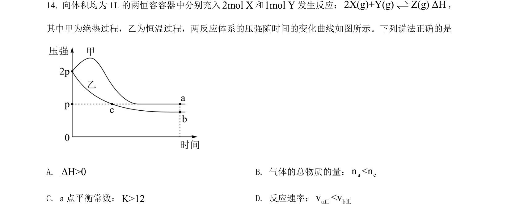
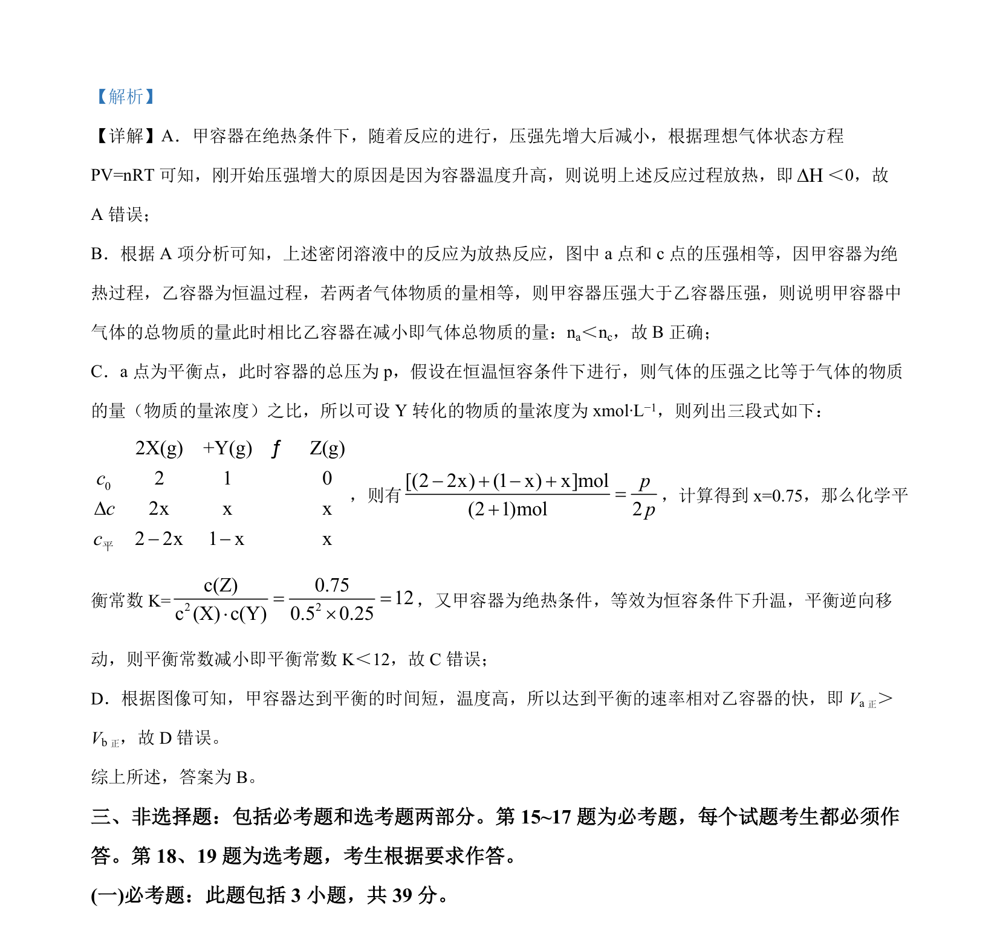

## 题面

## 摘要

考查绝热容器中放热反应的压强变化及平衡常数计算，涉及平衡移动与速率比较。

## 关联考点

- [[反应热效应]]
- [[284-化学平衡|化学平衡]]
- [[342-化学平衡常数|平衡常数]]
- [[283-化学反应速率|化学反应速率]]

## 答案与解析

> 📄 原 PDF 第 11 页：`素材/真题/湖南/2008-2024·（湖南）化学高考真题/2022年高考化学试卷（湖南）（解析卷）.pdf`
