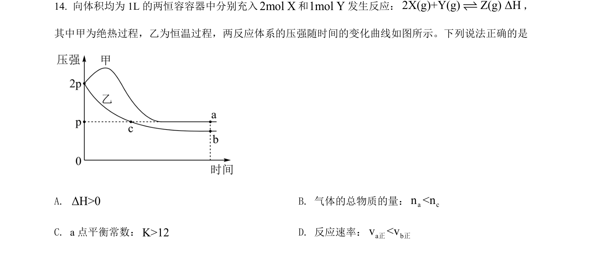
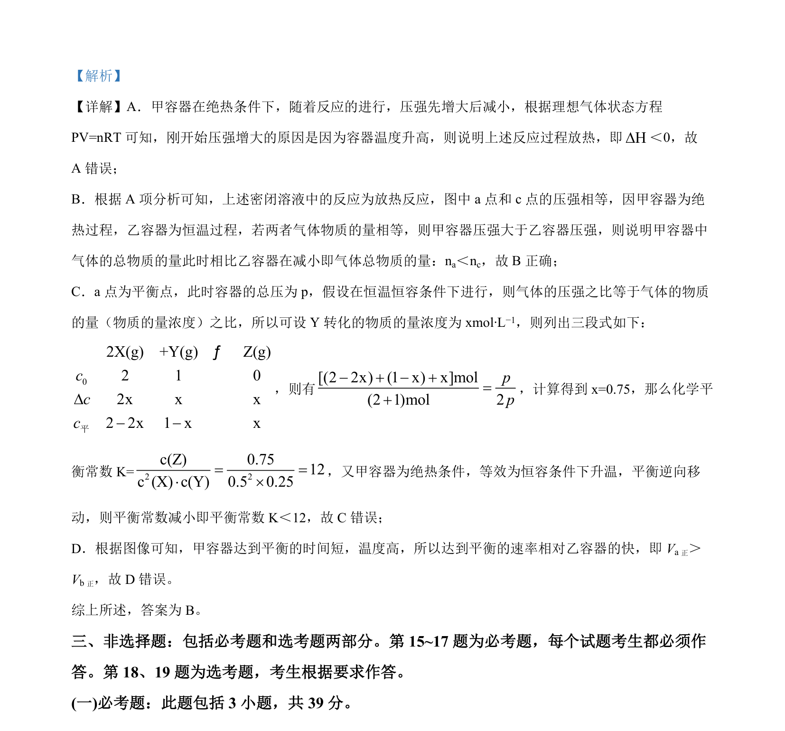

## 题面

## 摘要

考查绝热容器中放热反应的压强变化及平衡常数计算，涉及平衡移动与速率比较。

## 关联考点

- [[994-反应热效应|反应热效应]]
- [[284-化学平衡|化学平衡]]
- [[342-化学平衡常数|平衡常数]]
- [[283-化学反应速率|化学反应速率]]

## 答案与解析

> 📄 原 PDF 第 11 页：`素材/真题/湖南/2008-2024·（湖南）化学高考真题/2022年高考化学试卷（湖南）（解析卷）.pdf`

<!-- 题干文本-start -->
## 题干文本
14. 向体积均为 1L的两恒容容器中分别充入2mol X和1mol Y发生反应：2X(g)+Y(g) Z(g) ΔHƒ，
其中甲为绝热过程，乙为恒温过程，两反应体系的压强随时间的变化曲线如图所示。下列说法正确的是
A. ΔH>0B. 气体的总物质的量：a cn <n
C. a点平衡常数：K>12D. 反应速率：a bv <v正正
<!-- 题干文本-end -->

<!-- 解析文本-start -->
## 解析文本
【答案】B
<!-- 解析文本-end -->
