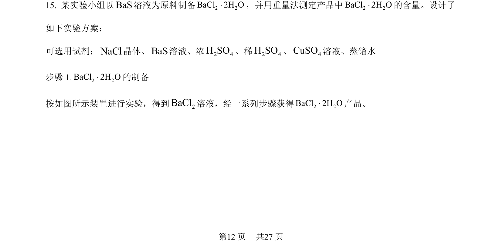
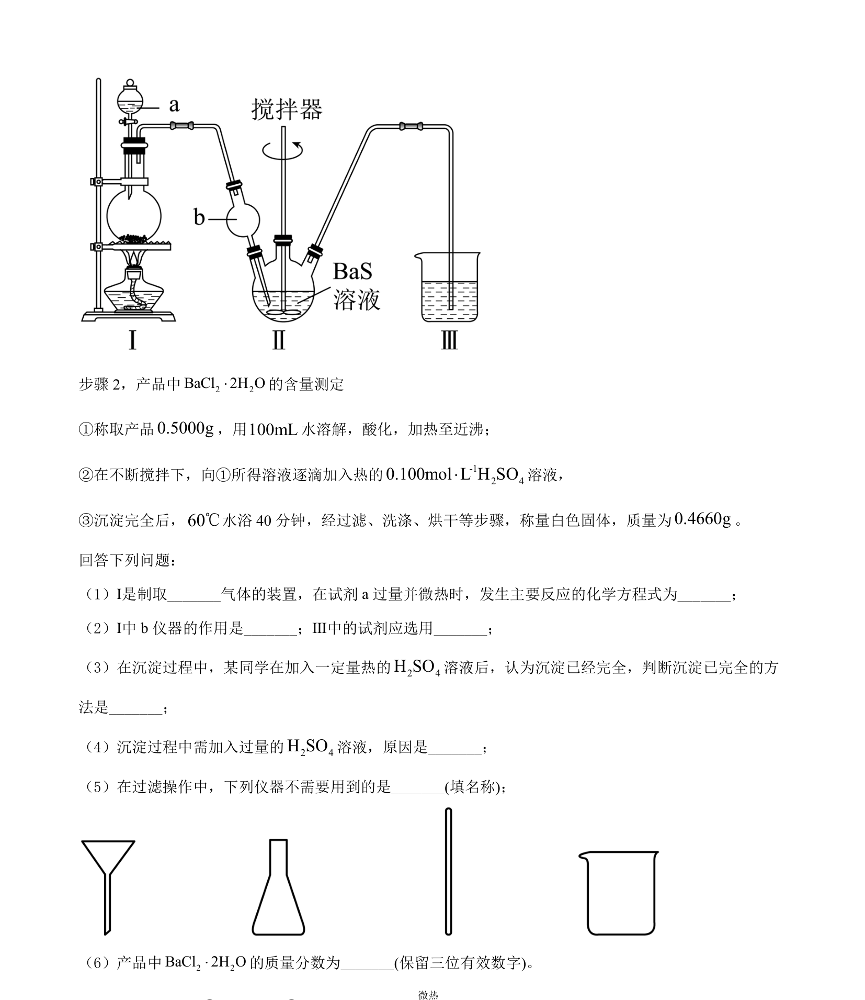
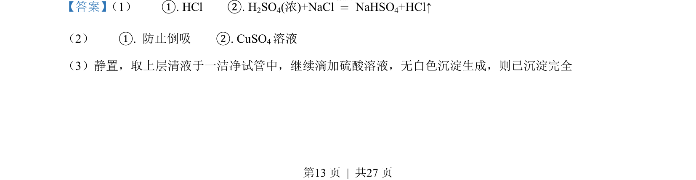
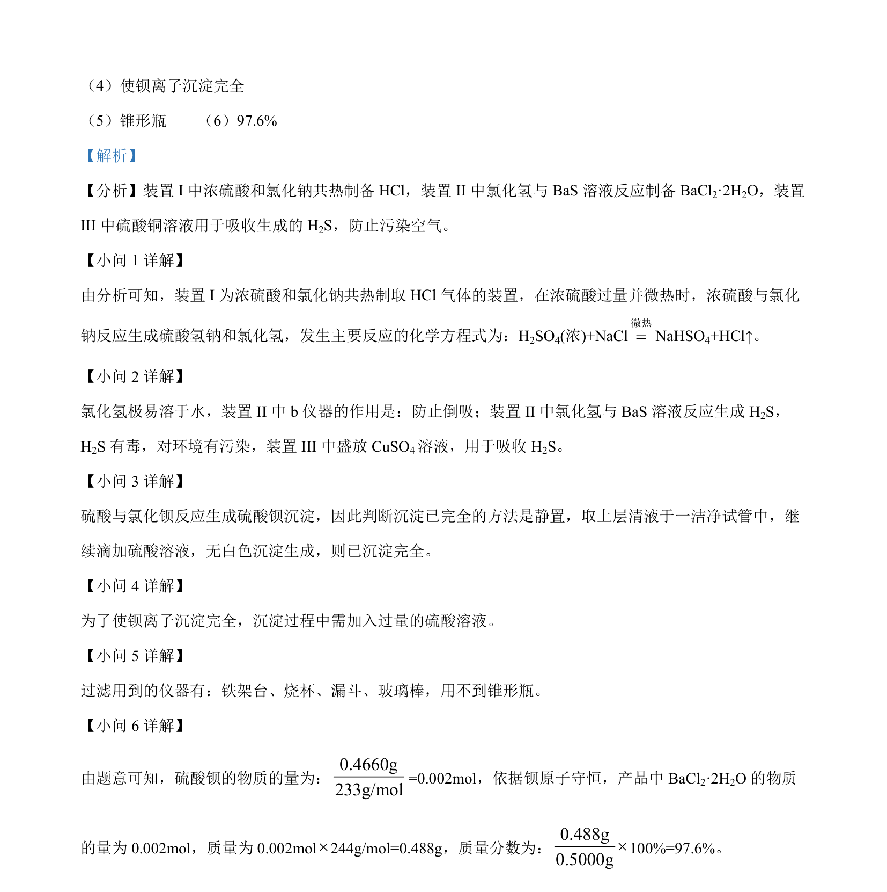

## 题面

## 摘要

该题考查BaCl₂·2H₂O的制备实验与含量测定，涉及气体制备、防倒吸、沉淀完全判断及质量分数计算。

## 关联考点

- [[气体制备]]
- [[防倒吸]]
- [[沉淀完全]]
- [[839-质量分数计算|质量分数计算]]
- [[284-化学平衡|化学平衡]]

## 答案与解析

> 📄 原 PDF 第 12 页：`素材/真题/湖南/2008-2024·（湖南）化学高考真题/2022年高考化学试卷（湖南）（解析卷）.pdf`
