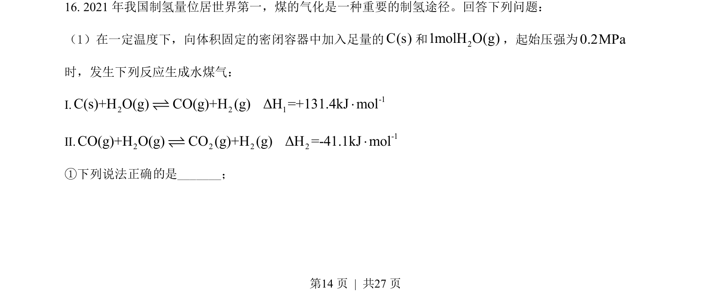
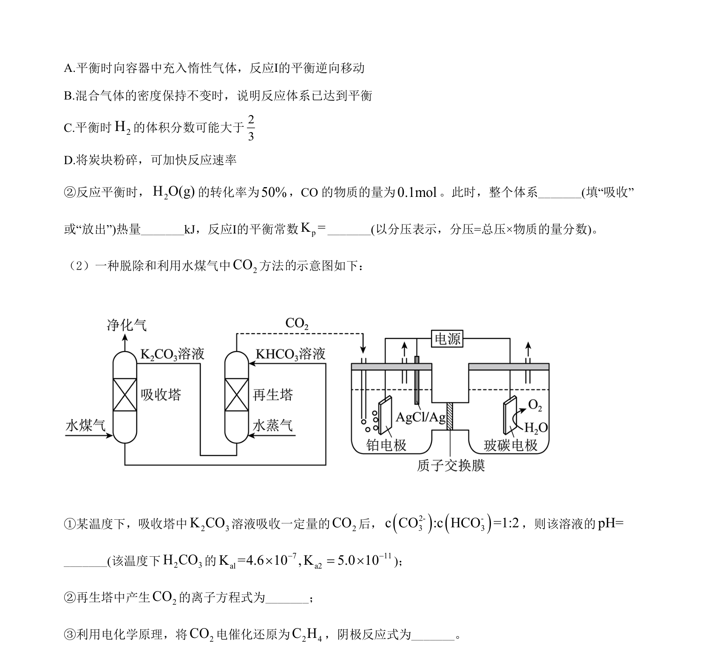
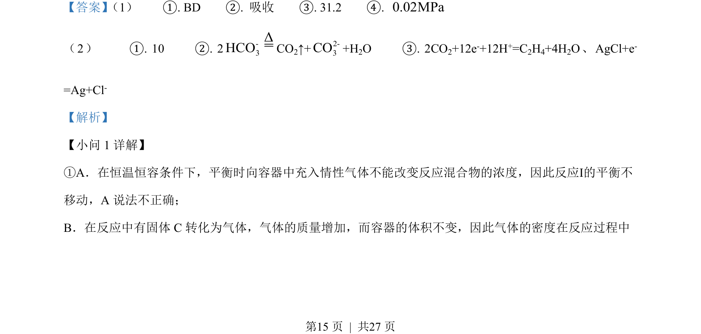
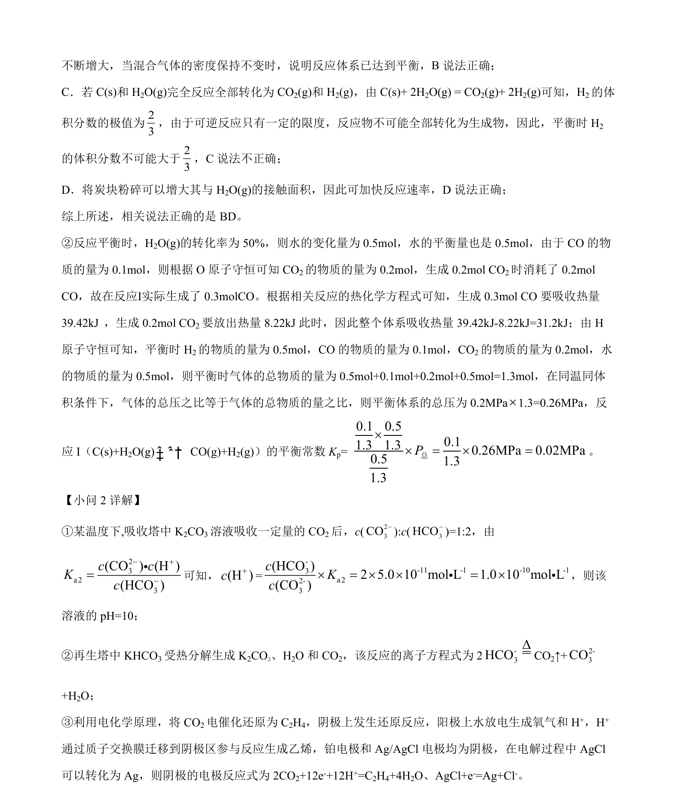

## 题面

## 摘要

考查化学平衡状态判断、速率影响因素及转化率与反应热相关计算。

## 关联考点

- [[化学平衡状态判断]]
- [[282-勒夏特列原理|勒夏特列原理]]
- [[843-转化率计算|转化率计算]]
- [[768-热化学方程式与反应热计算|反应热计算]]

## 答案与解析

> 📄 原 PDF 第 14 页：`素材/真题/湖南/2008-2024·（湖南）化学高考真题/2022年高考化学试卷（湖南）（解析卷）.pdf`
