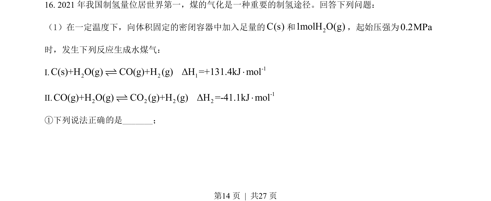
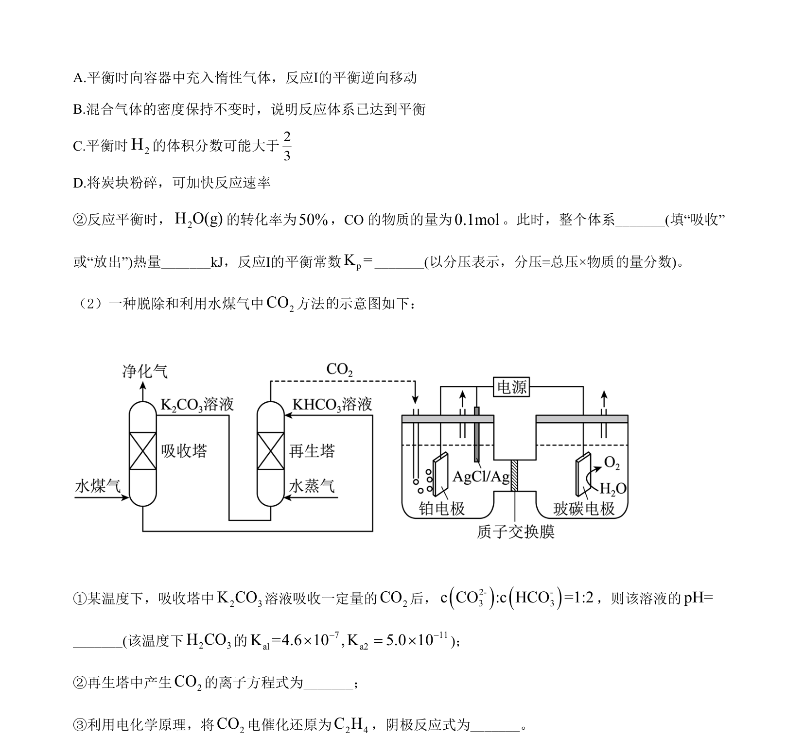
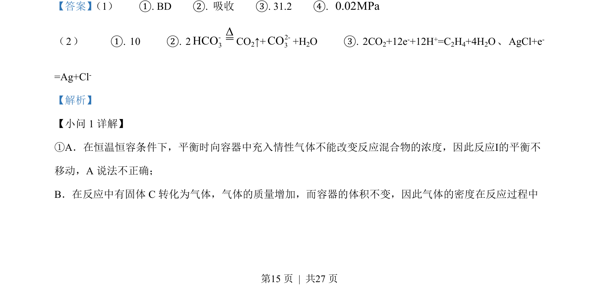
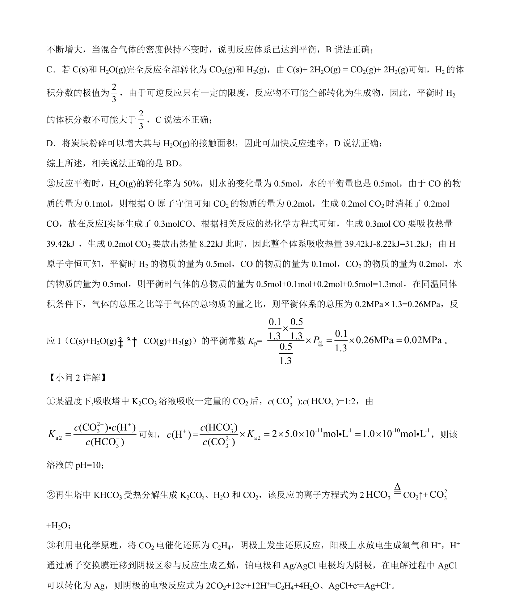

## 题面

## 摘要

考查化学平衡状态判断、速率影响因素及转化率与反应热相关计算。

## 关联考点

- [[化学平衡状态判断]]
- [[282-勒夏特列原理|勒夏特列原理]]
- [[843-转化率计算|转化率计算]]
- [[768-热化学方程式与反应热计算|反应热计算]]

## 答案与解析

> 📄 原 PDF 第 14 页：`素材/真题/湖南/2008-2024·（湖南）化学高考真题/2022年高考化学试卷（湖南）（解析卷）.pdf`

<!-- 题干文本-start -->
## 题干文本
16. 2021 年我国制氢量位居世界第一，煤的气化是一种重要的制氢途径。回答下列问题：
（1）在一定温度下，向体积固定的密闭容器中加入足量的C(s)和 21molH O(g)，起始压强为0.2MPa
时，发生下列反应生成水煤气：
Ⅰ. -12 2 1C(s)+H O(g) CO(g)+H (g)ΔH =+131.4kJ mol׃
Ⅱ. -12 2 2 2CO(g)+H O(g) CO (g)+H (g)ΔH =-41.1kJ mol׃
①下列说法正确 是_______；的
<!-- 题干文本-end -->

<!-- 解析文本-start -->
## 解析文本

<!-- 解析文本-end -->
