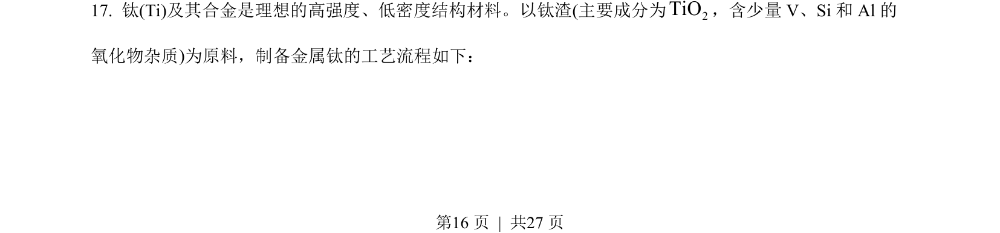
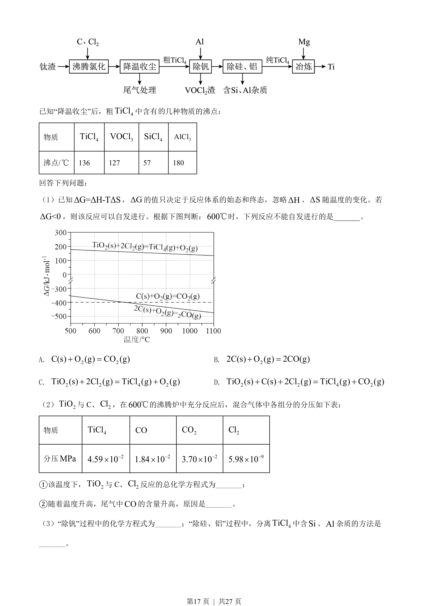
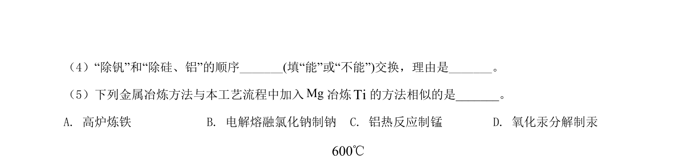
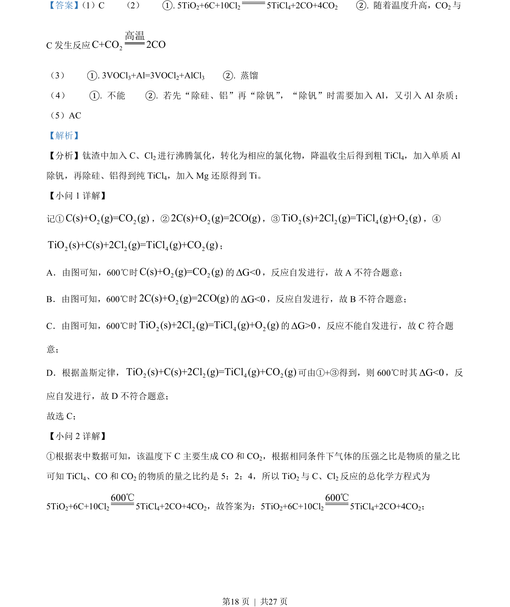
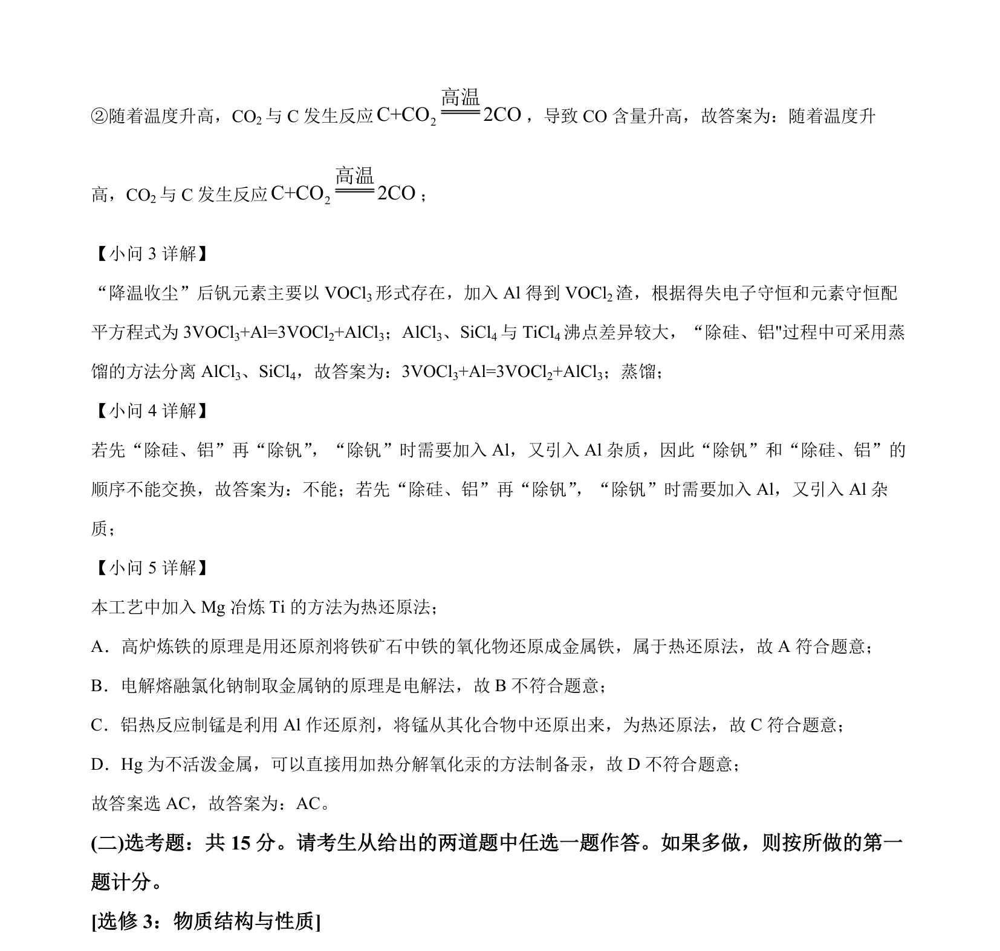

## 题面

## 摘要

考查反应自发性ΔG判据及盖斯定律应用，结合图表分析反应能否进行。

## 关联考点

- [[自发反应]]
- [[ΔG判据]]
- [[311-盖斯定律|盖斯定律]]
- [[309-热化学方程式|热化学方程式]]

## 答案与解析

> 📄 原 PDF 第 16 页：`素材/真题/湖南/2008-2024·（湖南）化学高考真题/2022年高考化学试卷（湖南）（解析卷）.pdf`
