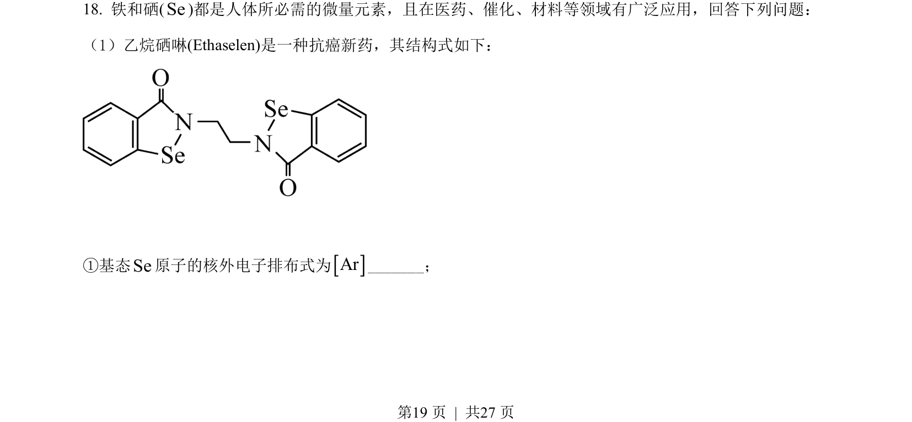
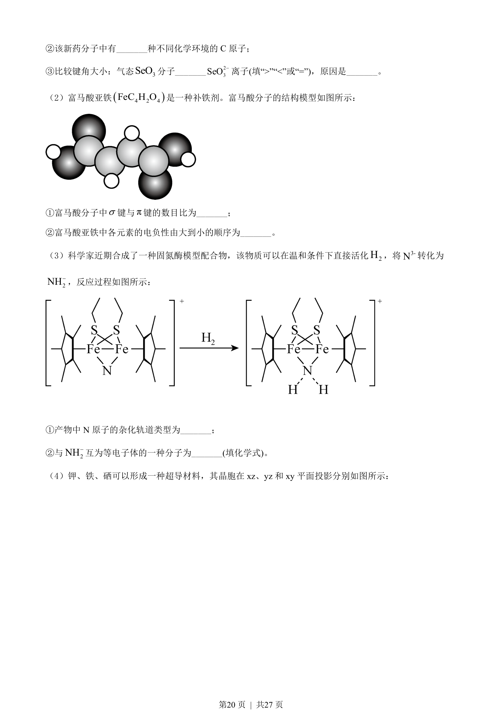
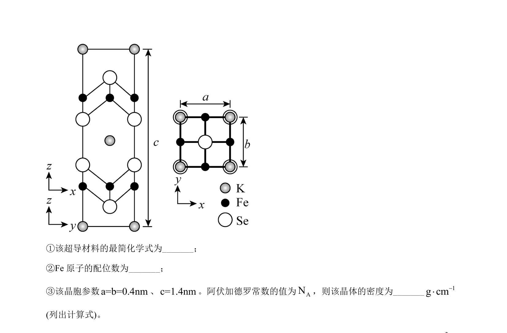
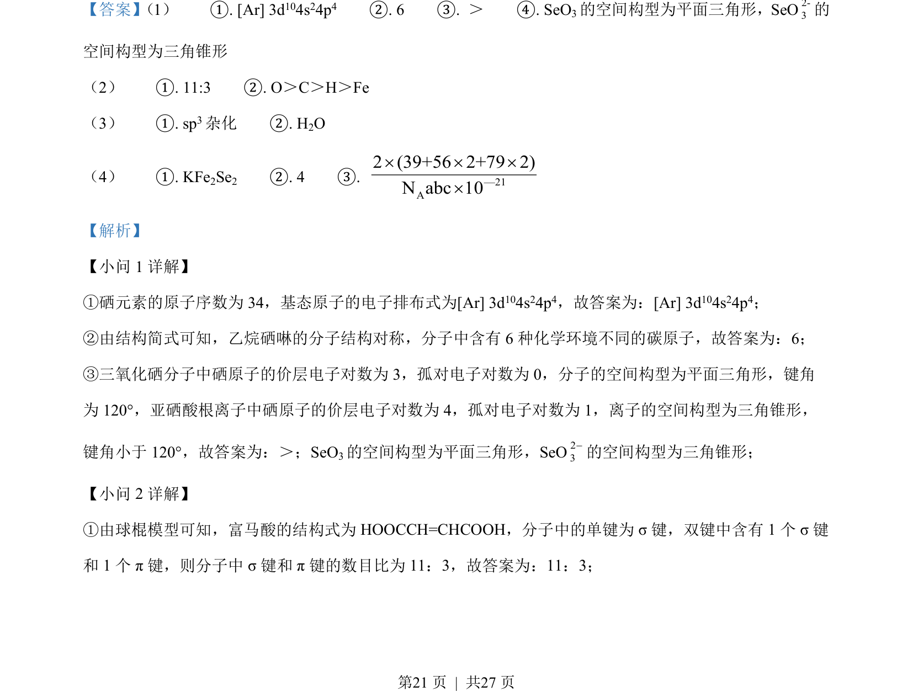
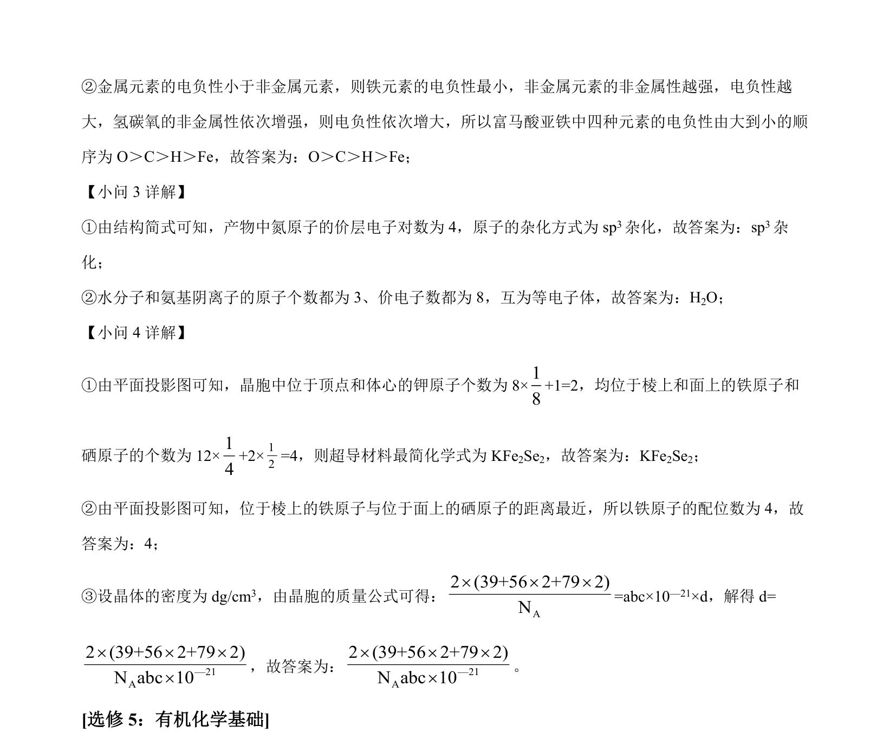

## 题面

## 摘要

本题考查物质结构与性质，涉及电子排布、电负性、杂化方式、晶胞计算等。

## 关联考点

- [[389-电子排布式|电子排布式]]
- [[391-电负性|电负性]]
- [[720-杂化轨道|杂化轨道]]
- [[晶胞密度]]

## 答案与解析

> 📄 原 PDF 第 19 页：`素材/真题/湖南/2008-2024·（湖南）化学高考真题/2022年高考化学试卷（湖南）（解析卷）.pdf`
