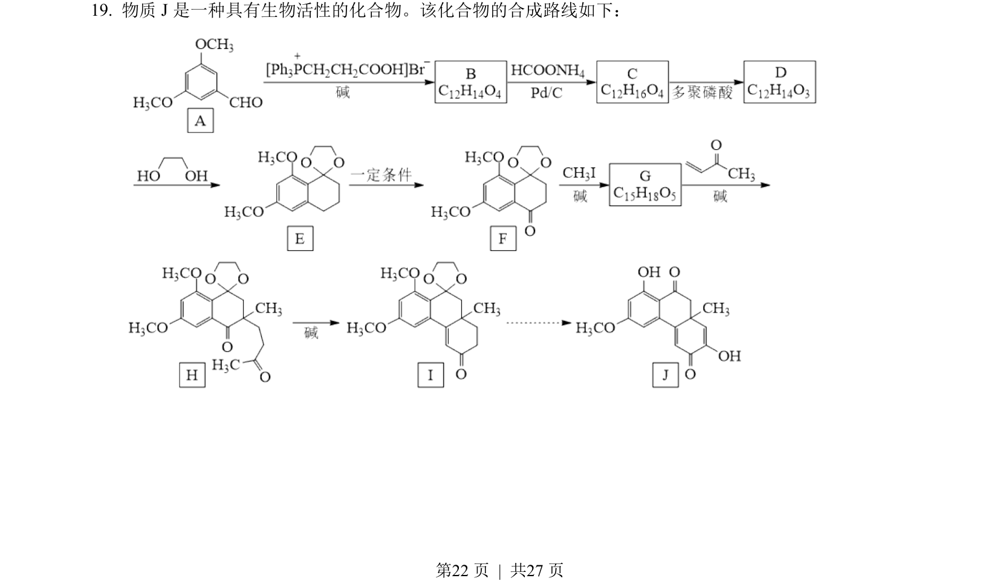
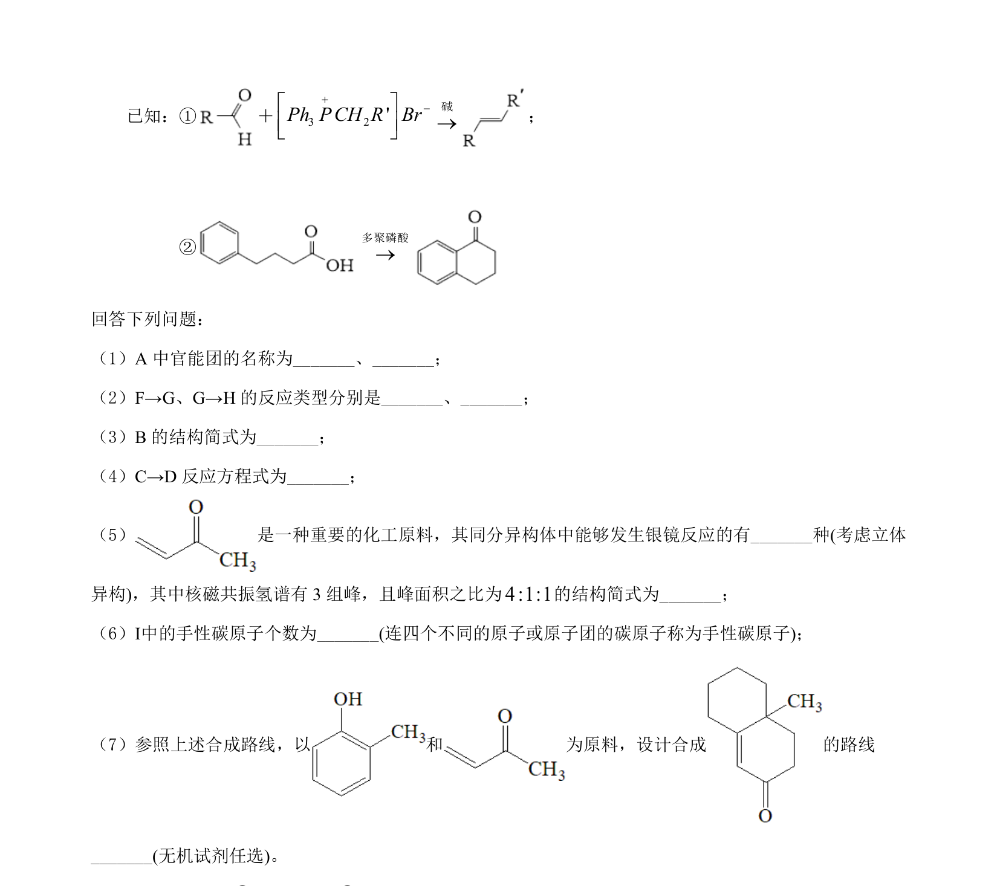
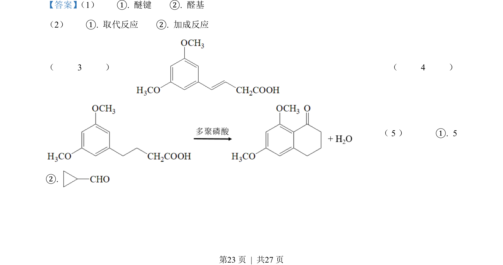
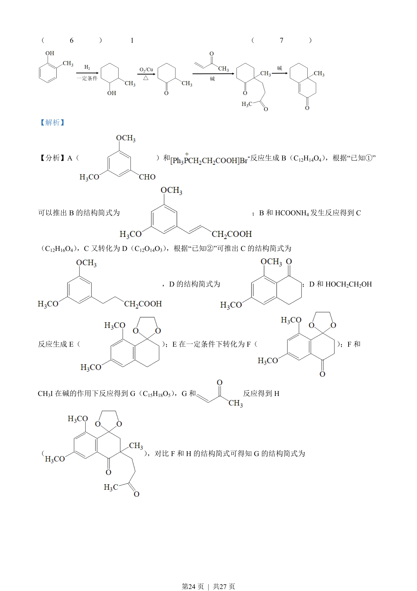
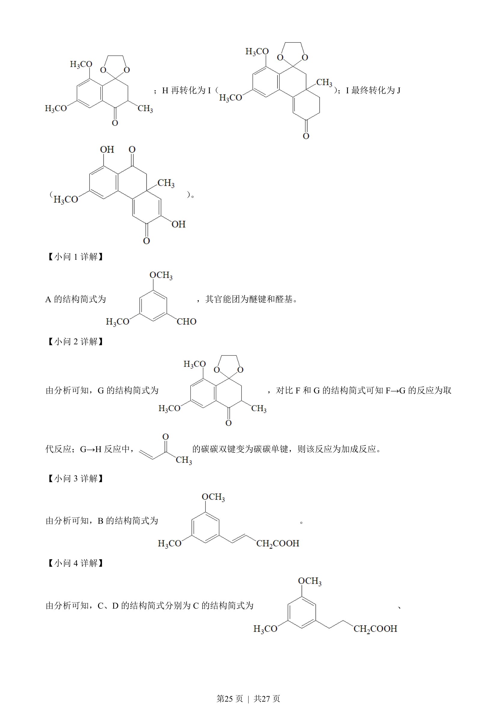
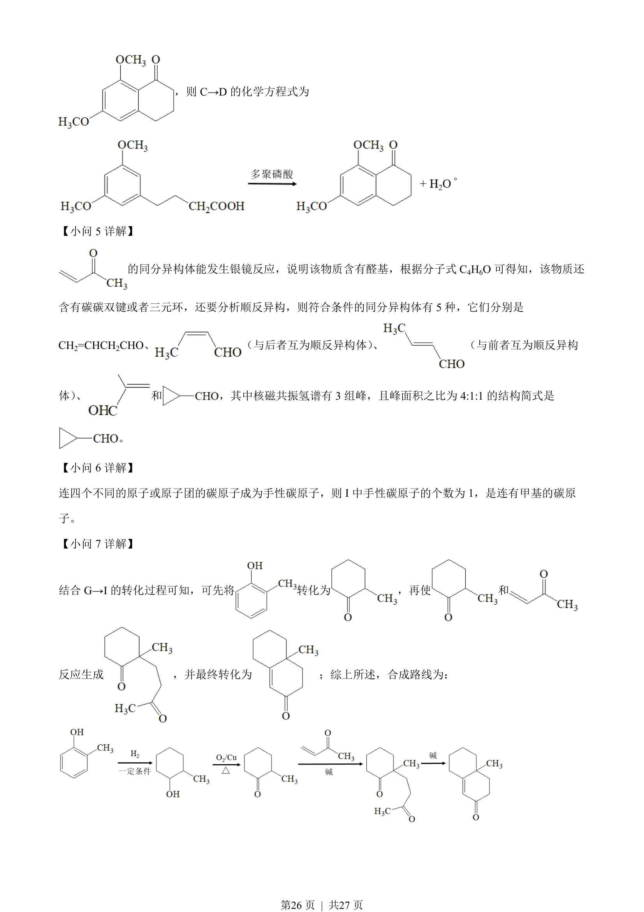

## 题面

## 摘要

有机合成路线推断，涉及结构简式、反应类型、方程式及同分异构体分析。

## 关联考点

- [[545-有机推断|有机推断]]
- [[448-官能团|官能团]]
- [[646-反应类型|反应类型]]
- [[446-同分异构体|同分异构体]]

## 答案与解析

> 📄 原 PDF 第 22 页：`素材/真题/湖南/2008-2024·（湖南）化学高考真题/2022年高考化学试卷（湖南）（解析卷）.pdf`
