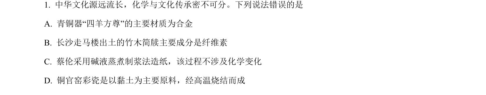
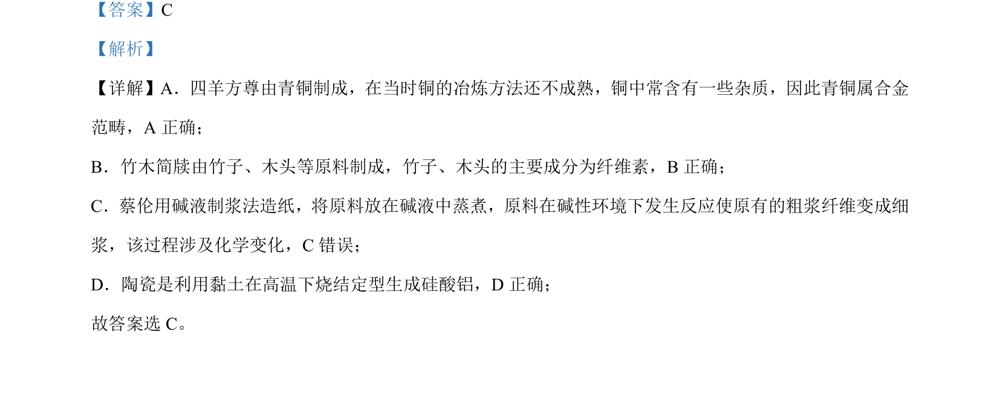

## 题面

## 摘要

考查常见物质的成分与变化判断，涉及青铜合金、竹木纤维素、造纸化学变化及陶瓷成分。

## 关联考点

- [[合金组成]]
- [[514-纤维素|纤维素]]
- [[001-化学变化|化学变化]]
- [[226-硅酸盐|硅酸盐]]

## 答案与解析

> 📄 原 PDF 第 1 页：`素材/真题/湖南/2008-2024·（湖南）化学高考真题/2023年高考化学试卷（湖南）（解析卷）.pdf`
