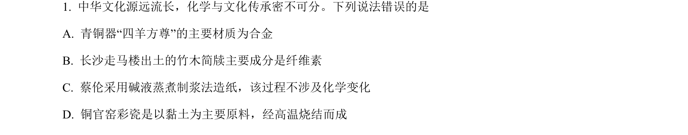
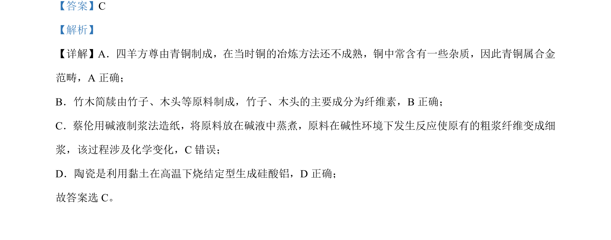

## 题面

## 摘要

考查常见物质的成分与变化判断，涉及青铜合金、竹木纤维素、造纸化学变化及陶瓷成分。

## 关联考点

- [[合金组成]]
- [[514-纤维素|纤维素]]
- [[001-化学变化|化学变化]]
- [[226-硅酸盐|硅酸盐]]

## 答案与解析

> 📄 原 PDF 第 1 页：`素材/真题/湖南/2008-2024·（湖南）化学高考真题/2023年高考化学试卷（湖南）（解析卷）.pdf`

<!-- 题干文本-start -->
## 题干文本
1. 中华文化源远流长，化学与文化传承密不可分。下列说法错误的是
A. 青铜器“四羊方尊”的主要材质为合金
B. 长沙走马楼出土的竹木简牍主要成分是纤维素
C. 蔡伦采用碱液蒸煮制浆法造纸，该过程不涉及化学变化
D. 铜官窑彩瓷是以黏土为主要原料，经高温烧结而成
<!-- 题干文本-end -->

<!-- 解析文本-start -->
## 解析文本
【答案】C
【解析】
【详解】A．四羊方尊由青铜制成，在当时铜的冶炼方法还不成熟，铜中常含有一些杂质，因此青铜属合金
范畴，A 正确；
B．竹木简牍由竹子、木头等原料制成，竹子、木头的主要成分为纤维素，B正确；
C．蔡伦用碱液制浆法造纸，将原料放在碱液中蒸煮，原料在碱性环境下发生反应使原有的粗浆纤维变成细
浆，该过程涉及化学变化，C错误；
D．陶瓷是利用黏土在高温下烧结定型生成硅酸铝，D 正确；
故答案选 C。
<!-- 解析文本-end -->
