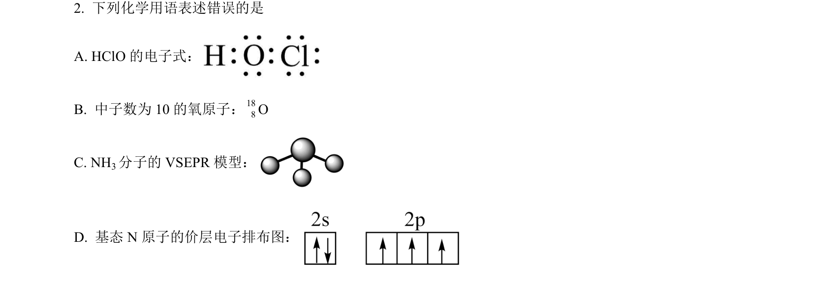
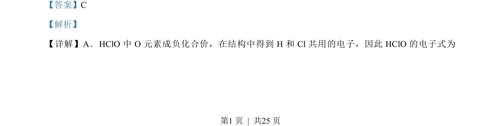
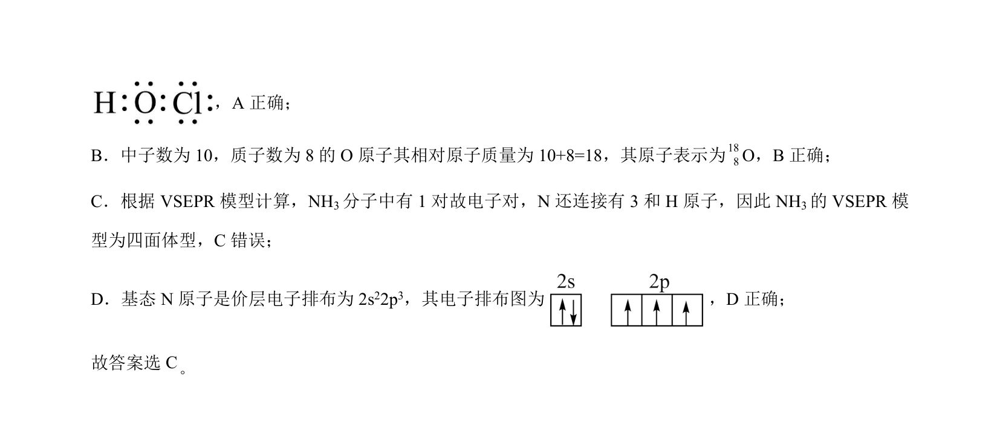

## 题面

## 摘要

该题考查化学基本概念的正误判断，涉及电子式书写、原子符号表示、VSEPR模型及电子排布图等。

## 关联考点

- [[266-电子式|电子式]]
- [[原子表示]]
- [[584-VSEPR模型|VSEPR模型]]
- [[790-电子排布|电子排布]]

## 答案与解析

> 📄 原 PDF 第 1 页：`素材/真题/湖南/2008-2024·（湖南）化学高考真题/2023年高考化学试卷（湖南）（解析卷）.pdf`
