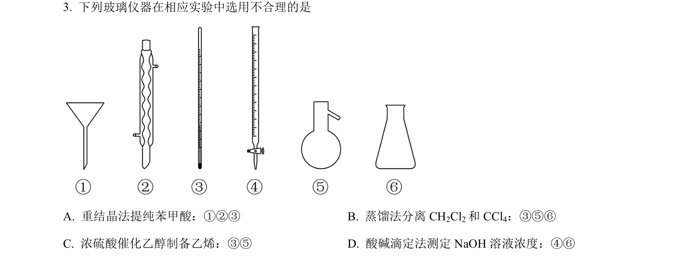
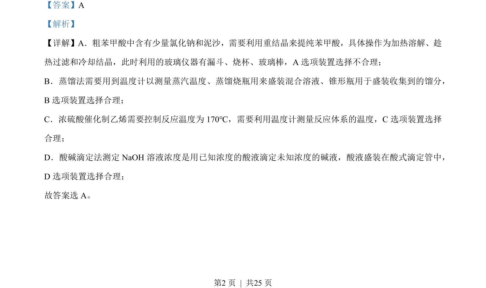

## 题面

## 摘要

本题考查粗苯甲酸重结晶、蒸馏、乙烯制备及酸碱滴定的实验装置选择。

## 关联考点

- [[粗苯甲酸提纯]]
- [[079-蒸馏|蒸馏]]
- [[乙烯制备]]
- [[854-酸碱滴定|酸碱滴定]]

## 答案与解析

> 📄 原 PDF 第 2 页：`素材/真题/湖南/2008-2024·（湖南）化学高考真题/2023年高考化学试卷（湖南）（解析卷）.pdf`
