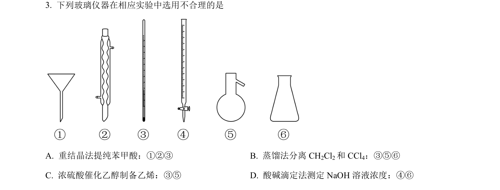
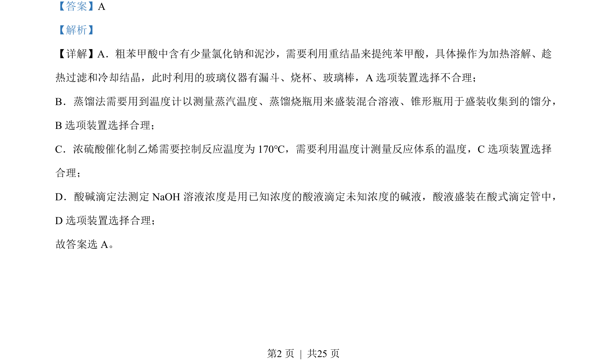

## 题面

## 摘要

本题考查粗苯甲酸重结晶、蒸馏、乙烯制备及酸碱滴定的实验装置选择。

## 关联考点

- [[粗苯甲酸提纯]]
- [[079-蒸馏|蒸馏]]
- [[乙烯制备]]
- [[854-酸碱滴定|酸碱滴定]]

## 答案与解析

> 📄 原 PDF 第 2 页：`素材/真题/湖南/2008-2024·（湖南）化学高考真题/2023年高考化学试卷（湖南）（解析卷）.pdf`

<!-- 题干文本-start -->
## 题干文本
3. 下列玻璃仪器在相应实验中选用不合理的是
A. 重结晶法提纯苯甲酸：①②③ B. 蒸馏法分离 CH2Cl2和 CCl4：③⑤⑥
C. 浓硫酸催化乙醇制备乙烯：③⑤ D. 酸碱滴定法测定 NaOH 溶液浓度：④⑥
<!-- 题干文本-end -->

<!-- 解析文本-start -->
## 解析文本
【答案】A
【解析】
【详解】A．粗苯甲酸中含有少量氯化钠和泥沙，需要利用重结晶来提纯苯甲酸，具体操作为加热溶解、趁
热过滤和冷却结晶，此时利用的玻璃仪器有漏斗、烧杯、玻璃棒，A 选项装置选择不合理；
B．蒸馏法需要用到温度计以测量蒸汽温度、蒸馏烧瓶用来盛装混合溶液、锥形瓶用于盛装收集到的馏分，
B选项装置选择合理；
C．浓硫酸催化制乙烯需要控制反应温度为 170℃，需要利用温度计测量反应体系的温度，C 选项装置选择
合理；
D．酸碱滴定法测定 NaOH 溶液浓度是用已知浓度的酸液滴定未知浓度的碱液，酸液盛装在酸式滴定管中，
D 选项装置选择合理；
故答案选 A。
。
<!-- 解析文本-end -->
