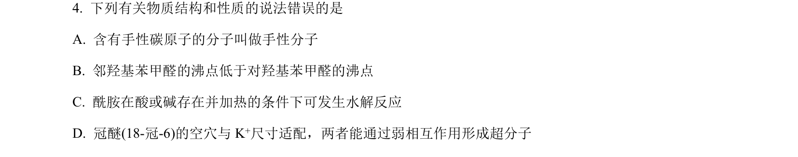
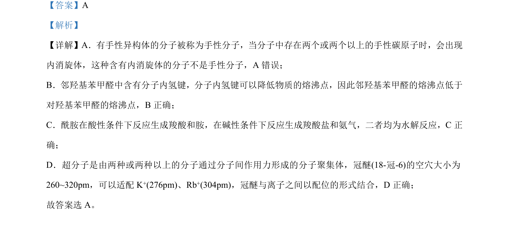

## 题面

## 摘要

判断手性分子、氢键、酰胺水解及超分子概念的正误

## 关联考点

- [[手性分子]]
- [[内消旋体]]
- [[435-氢键|氢键]]
- [[842-超分子|超分子]]

## 答案与解析

> 📄 原 PDF 第 3 页：`素材/真题/湖南/2008-2024·（湖南）化学高考真题/2023年高考化学试卷（湖南）（解析卷）.pdf`

<!-- 题干文本-start -->
## 题干文本
4. 下列有关物质结构和性质的说法错误的是
A. 含有手性碳原子的分子叫做手性分子
B. 邻羟基苯甲醛的沸点低于对羟基苯甲醛的沸点
C. 酰胺在酸或碱存在并加热的条件下可发生水解反应
D. 冠醚(18-冠-6)的空穴与 K+尺寸适配，两者能通过弱相互作用形成超分子
<!-- 题干文本-end -->

<!-- 解析文本-start -->
## 解析文本
【答案】A
【解析】
【详解】A．有手性异构体的分子被称为手性分子，当分子中存在两个或两个以上的手性碳原子时，会出现
内消旋体，这种含有内消旋体的分子不是手性分子，A 错误；
B．邻羟基苯甲醛中含有分子内氢键，分子内氢键可以降低物质的熔沸点，因此邻羟基苯甲醛的熔沸点低于
对羟基苯甲醛的熔沸点，B正确；
C．酰胺在酸性条件下反应生成羧酸和胺，在碱性条件下反应生成羧酸盐和氨气，二者均为水解反应，C正
确；
D．超分子是由两种或两种以上的分子通过分子间作用力形成的分子聚集体，冠醚 (18-冠-6)的空穴大小为
260~320pm，可以适配 K+(276pm)、Rb+(304pm)，冠醚与离子之间以配位的形式结合，D 正确；
故答案选 A。
<!-- 解析文本-end -->
