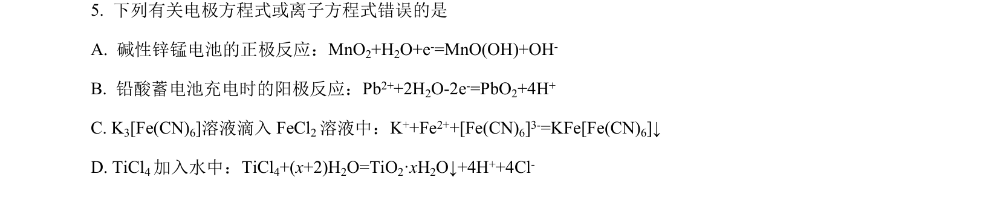
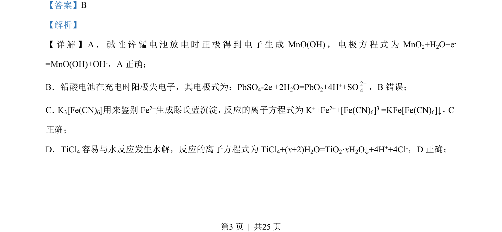

## 题面

## 摘要

结合荧光粉化学式推断前20号元素，考查元素周期律及单质、化合物性质。

## 关联考点

- [[597-元素推断|元素推断]]
- [[391-电负性|电负性]]
- [[634-原子半径|原子半径]]
- [[单质与水反应]]

## 答案与解析

> 📄 原 PDF 第 3 页：`素材/真题/湖南/2008-2024·（湖南）化学高考真题/2023年高考化学试卷（湖南）（解析卷）.pdf`

<!-- 题干文本-start -->
## 题干文本
5. 下列有关电极方程式或离子方程式错误的是
A. 碱性锌锰电池的正极反应：MnO2+H2O+e-=MnO(OH)+OH-
B. 铅酸蓄电池充电时的阳极反应：Pb2++2H2O-2e-=PbO2+4H+
C. K3[Fe(CN)6]溶液滴入 FeCl2溶液中：K++Fe2++[Fe(CN)6]3-=KFe[Fe(CN)6]↓
D. TiCl4加入水中：TiCl4+(x+2)H2O=TiO2·xH2O↓+4H++4Cl-
<!-- 题干文本-end -->

<!-- 解析文本-start -->
## 解析文本
【答案】B
【解析】
【 详 解 】A．碱性锌锰电池放电时正极得到电子生成 MnO(OH)，电极方程式为 MnO2+H2O+e-
=MnO(OH)+OH-，A 正确；
B．铅酸电池在充电时阳极失电子，其电极式为：PbSO4-2e-+2H2O=PbO2+4H++SO24-，B错误；
C．K3[Fe(CN)6]用来鉴别 Fe2+生成滕氏蓝沉淀， 反应的离子方程式为K++Fe2++[Fe(CN)6]3-=KFe[Fe(CN)6]↓，C
正确；
D．TiCl4容易与水反应发生水解，反应的离子方程式为 TiCl4+(x+2)H2O=TiO2·xH2O↓+4H++4Cl-，D 正确；
<!-- 解析文本-end -->
