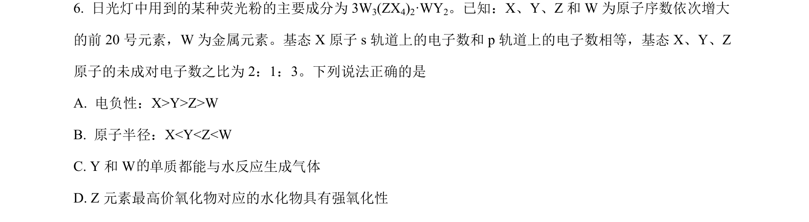
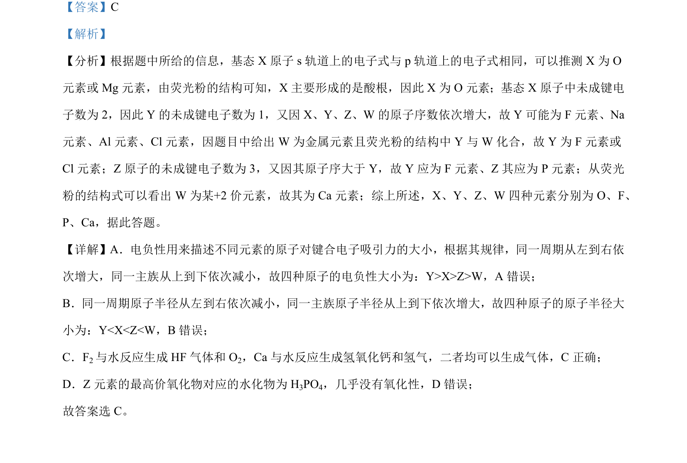

## 题面

## 摘要

通过原子结构和未成键电子数推断元素，考查元素周期律和物质性质。

## 关联考点

- [[638-原子结构与元素推断|原子结构与元素推断]]
- [[391-电负性|电负性]]
- [[634-原子半径|原子半径]]
- [[596-元素化合物性质|元素化合物性质]]

## 答案与解析

> 📄 原 PDF 第 4 页：`素材/真题/湖南/2008-2024·（湖南）化学高考真题/2023年高考化学试卷（湖南）（解析卷）.pdf`
