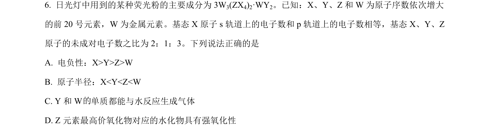
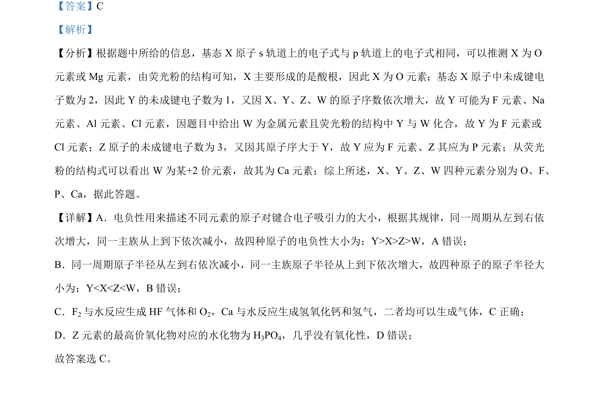

## 题面

## 摘要

通过原子结构和未成键电子数推断元素，考查元素周期律和物质性质。

## 关联考点

- [[638-原子结构与元素推断|原子结构与元素推断]]
- [[391-电负性|电负性]]
- [[634-原子半径|原子半径]]
- [[596-元素化合物性质|元素化合物性质]]

## 答案与解析

> 📄 原 PDF 第 4 页：`素材/真题/湖南/2008-2024·（湖南）化学高考真题/2023年高考化学试卷（湖南）（解析卷）.pdf`

<!-- 题干文本-start -->
## 题干文本
6. 日光灯中用到的某种荧光粉的主要成分为 3W3(ZX4)2·WY2。已知：X、Y、Z和 W为原子序数依次增大
的前 20 号元素，W为金属元素。基态 X 原子 s 轨道上的电子数和 p 轨道上的电子数相等，基态 X、Y、Z
原子的未成对电子数之比为 2：1：3。下列说法正确的是
A. 电负性：X>Y>Z>W
B. 原子半径：X<Y<Z<W
C. Y 和 W 单质都能与水反应生成气体
D. Z 元素最高价氧化物对应的水化物具有强氧化性
<!-- 题干文本-end -->

<!-- 解析文本-start -->
## 解析文本
【答案】C
【解析】
【分析】根据题中所给的信息，基态 X 原子 s 轨道上的电子式与 p 轨道上的电子式相同，可以推测 X 为 O
元素或 Mg 元素，由荧光粉的结构可知，X 主要形成的是酸根，因此 X 为 O 元素；基态 X 原子中未成键电
子数为 2，因此 Y 的未成键电子数为 1，又因 X、Y、Z、W的原子序数依次增大，故 Y 可能为 F 元素、Na
元素、Al 元素、Cl 元素，因题目中给出 W 为金属元素且荧光粉的结构中 Y 与 W 化合，故 Y 为 F 元素或
Cl 元素；Z 原子的未成键电子数为 3，又因其原子序大于 Y，故 Y 应为 F 元素、Z 其应为 P 元素；从荧光
粉的结构式可以看出 W 为某+2 价元素，故其为 Ca 元素；综上所述，X、Y、Z、W 四种元素分别为 O、F、
P、Ca，据此答题。
【详解】A．电负性用来描述不同元素的原子对键合电子吸引力的大小，根据其规律，同一周期从左到右依
次增大，同一主族从上到下依次减小，故四种原子的电负性大小为：Y>X>Z>W，A 错误；
B．同一周期原子半径从左到右依次减小，同一主族原子半径从上到下依次增大，故四种原子的原子半径大
小为：Y<X<Z<W，B错误；
C．F2与水反应生成 HF 气体和 O2，Ca与水反应生成氢氧化钙和氢气，二者均可以生成气体，C正确；
D．Z元素的最高价氧化物对应的水化物为 H3PO4，几乎没有氧化性，D 错误；
故答案选 C。
<!-- 解析文本-end -->
