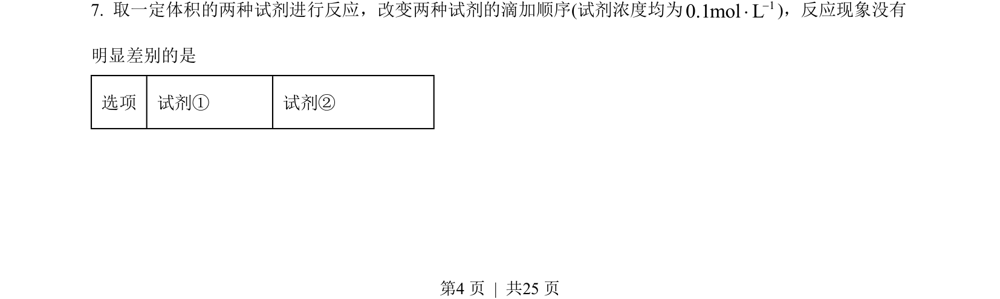
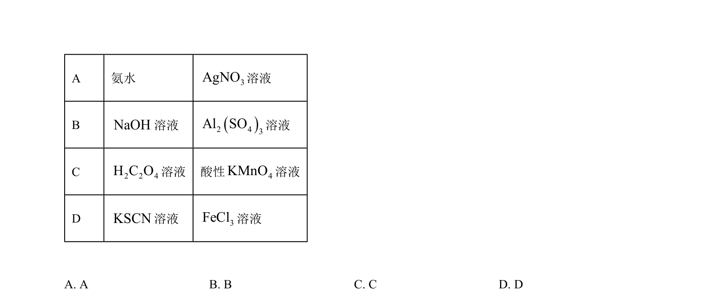
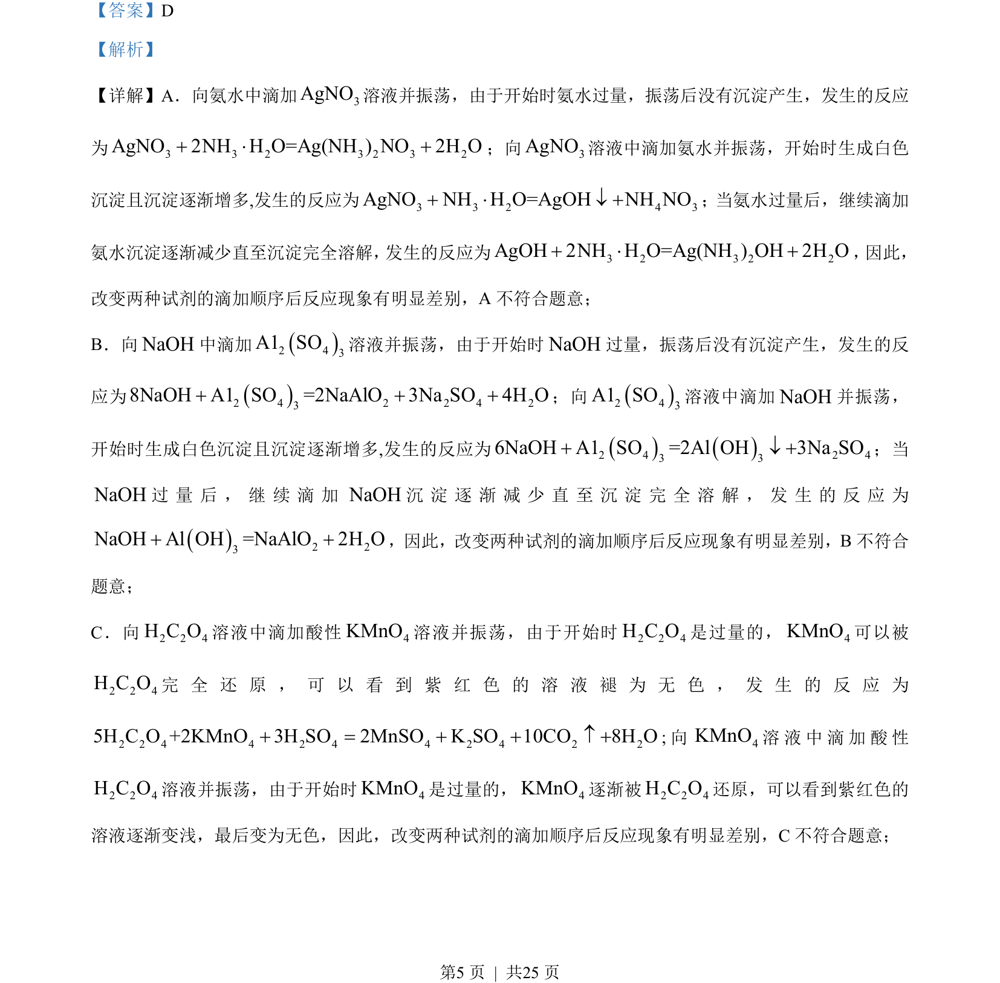
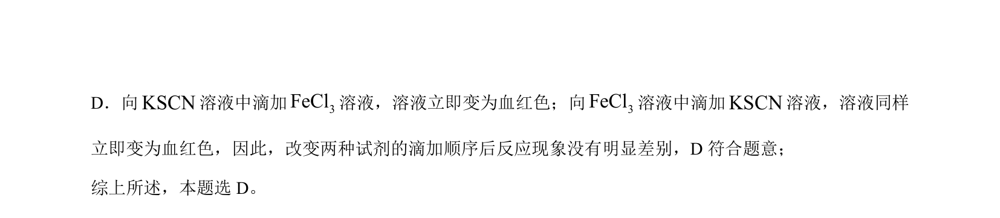

## 题面

## 摘要

比较试剂滴加顺序对反应现象的影响，D项KSCN与FeCl₃混合现象相同。

## 关联考点

- [[328-沉淀溶解平衡|沉淀溶解平衡]]
- [[441-配合物|配合物]]
- [[162-氧化还原反应|氧化还原反应]]
- [[671-实验现象|实验现象]]

## 答案与解析

> 📄 原 PDF 第 4 页：`素材/真题/湖南/2008-2024·（湖南）化学高考真题/2023年高考化学试卷（湖南）（解析卷）.pdf`

<!-- 题干文本-start -->
## 题干文本
7. 取一定体积的两种试剂进行反应，改变两种试剂的滴加顺序(试剂浓度均为 10.1mol L-×)，反应现象没有
明显差别的是
选项 试剂① 试剂②
的
<!-- 题干文本-end -->

<!-- 解析文本-start -->
## 解析文本

<!-- 解析文本-end -->
