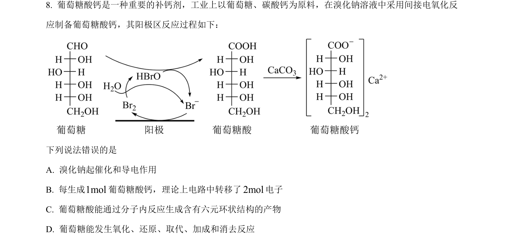
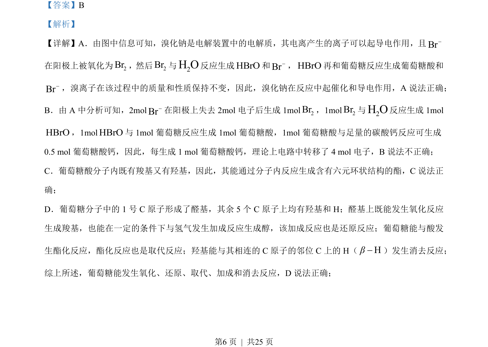
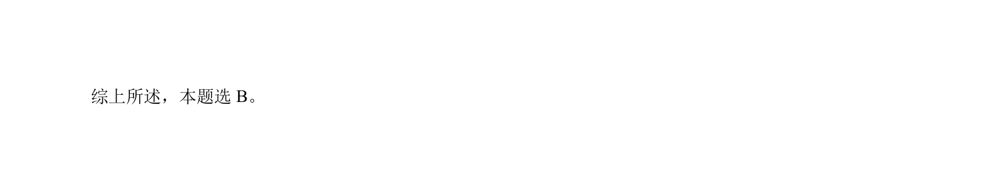

## 题面

## 摘要

考查处理铜冶金污水的工艺流程，涉及沉淀pH控制、溶度积计算及离子分离。

## 关联考点

- [[328-沉淀溶解平衡|沉淀溶解平衡]]
- [[891-溶度积计算|溶度积计算]]
- [[336-盐类水解|盐类水解]]
- [[离子分离]]

## 答案与解析

> 📄 原 PDF 第 6 页：`素材/真题/湖南/2008-2024·（湖南）化学高考真题/2023年高考化学试卷（湖南）（解析卷）.pdf`
