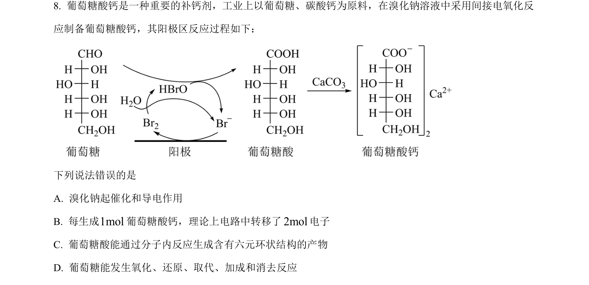
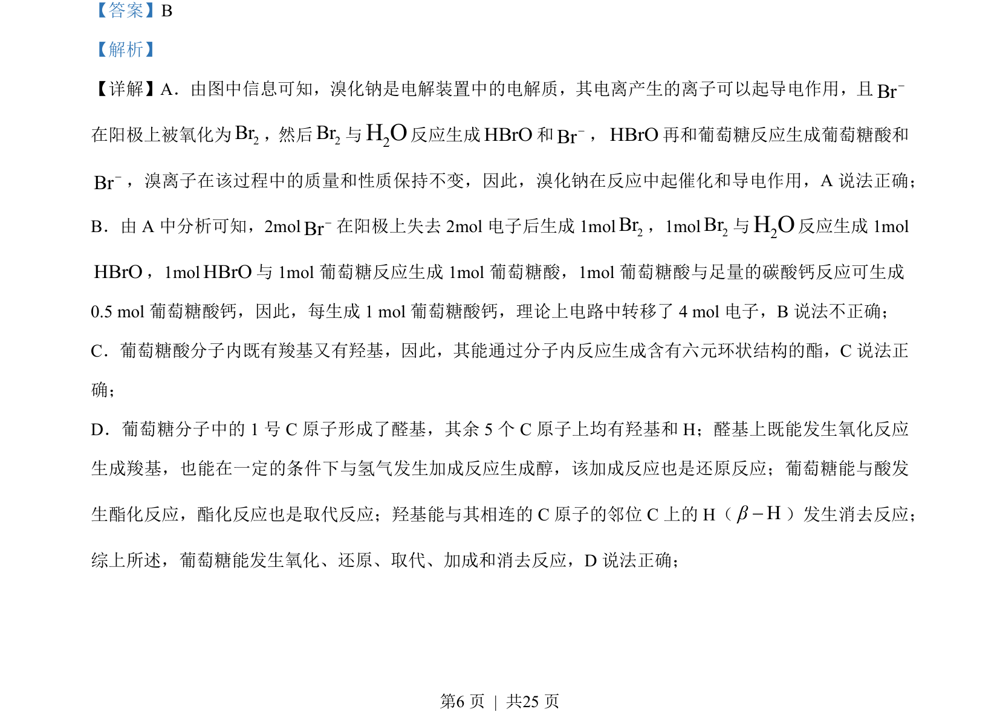

## 题面

## 摘要

考查处理铜冶金污水的工艺流程，涉及沉淀pH控制、溶度积计算及离子分离。

## 关联考点

- [[328-沉淀溶解平衡|沉淀溶解平衡]]
- [[891-溶度积计算|溶度积计算]]
- [[336-盐类水解|盐类水解]]
- [[离子分离]]

## 答案与解析

> 📄 原 PDF 第 6 页：`素材/真题/湖南/2008-2024·（湖南）化学高考真题/2023年高考化学试卷（湖南）（解析卷）.pdf`

<!-- 题干文本-start -->
## 题干文本
8. 葡萄糖酸钙是一种重要的补钙剂，工业上以葡萄糖、碳酸钙为原料，在溴化钠溶液中采用间接电氧化反
应制备葡萄糖酸钙，其阳极区反应过程如下：
    
下列说法错误的是
A. 溴化钠起催化和导电作用
B. 每生成1mol葡萄糖酸钙，理论上电路中转移了2mol电子
C. 葡萄糖酸能通过分子内反应生成含有六元环状结构的产物
D. 葡萄糖能发生氧化、还原、取代、加成和消去反应
<!-- 题干文本-end -->

<!-- 解析文本-start -->
## 解析文本
【答案】B
【解析】
【详解】A．由图中信息可知，溴化钠是电解装置中的电解质，其电离产生的离子可以起导电作用，且Br-
在阳极上被氧化为2Br， 然后2Br与2H O反应生成HBrO和Br-，HBrO再和葡萄糖反应生成葡萄糖酸和
Br-，溴离子在该过程中的质量和性质保持不变，因此，溴化钠在反应中起催化和导电作用， A 说法正确；
B．由 A 中分析可知，2molBr-在阳极上失去 2mol电子后生成 1mol2Br，1mol2Br与2H O反应生成 1mol
HBrO，1molHBrO与 1mol 葡萄糖反应生成 1mol 葡萄糖酸，1mol 葡萄糖酸与足量的碳酸钙反应可生成
0.5 mol葡萄糖酸钙，因此，每生成 1 mol葡萄糖酸钙，理论上电路中转移了 4 mol电子，B说法不正确；
C．葡萄糖酸分子内既有羧基又有羟基，因此，其能通过分子内反应生成含有六元环状结构的酯，C说法正
确；
D．葡萄糖分子中的 1 号 C 原子形成了醛基，其余 5 个 C 原子上均有羟基和 H；醛基上既能发生氧化反应
生成羧基，也能在一定的条件下与氢气发生加成反应生成醇，该加成反应也是还原反应；葡萄糖能与酸发
生酯化反应，酯化反应也是取代反应；羟基能与其相连的 C 原子的邻位 C 上的 H（Hβ-）发生消去反应；
综上所述，葡萄糖能发生氧化、还原、取代、加成和消去反应，D 说法正确；
<!-- 解析文本-end -->
