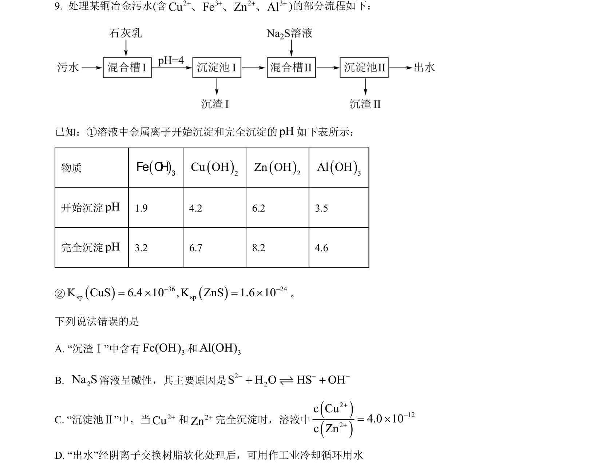
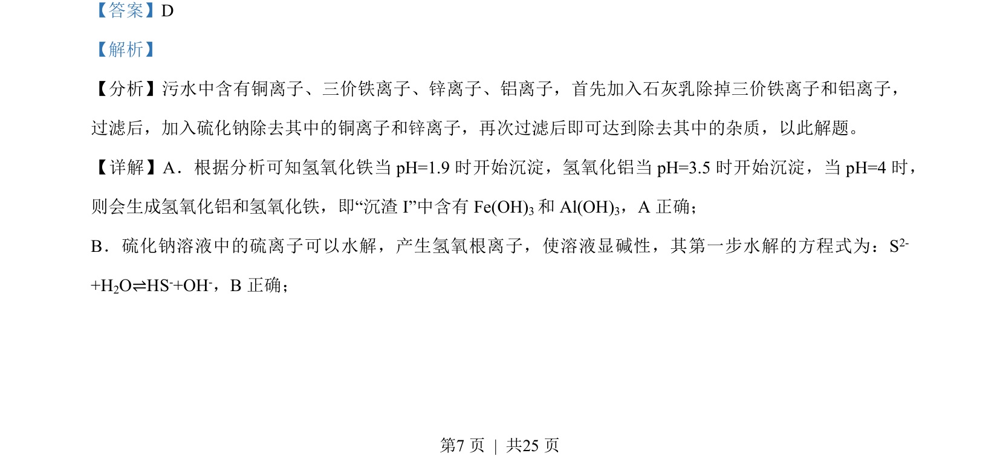
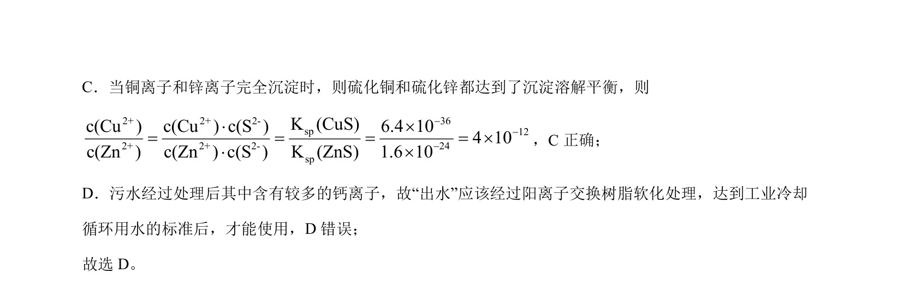

## 题面

## 摘要

该题考查颜料雌黄(As₂S₃)在空气湿度和光照下褪色的反应,涉及物质空间结构和氧化还原分析。

## 关联考点

- [[物质空间结构]]
- [[162-氧化还原反应|氧化还原反应]]
- [[电子转移计算]]

## 答案与解析

> 📄 原 PDF 第 7 页：`素材/真题/湖南/2008-2024·（湖南）化学高考真题/2023年高考化学试卷（湖南）（解析卷）.pdf`
