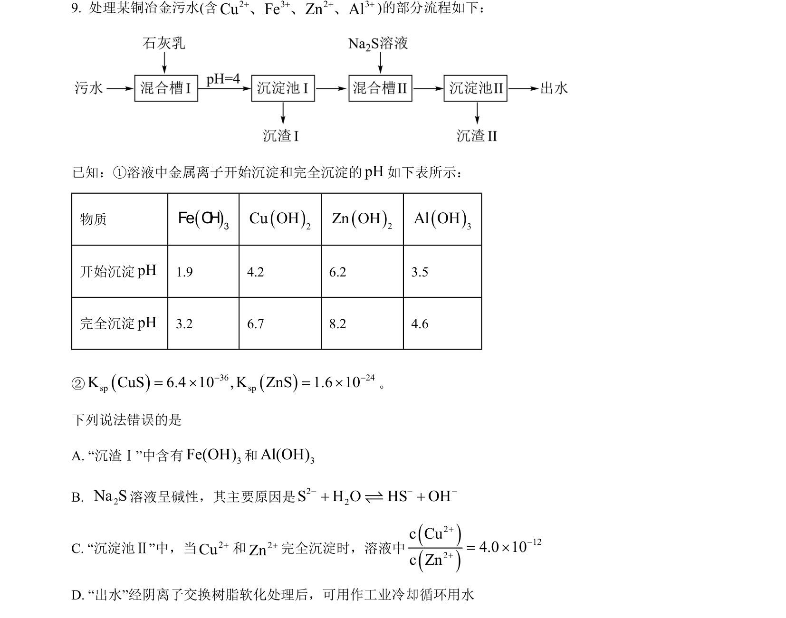
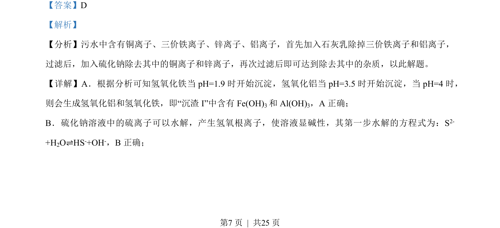
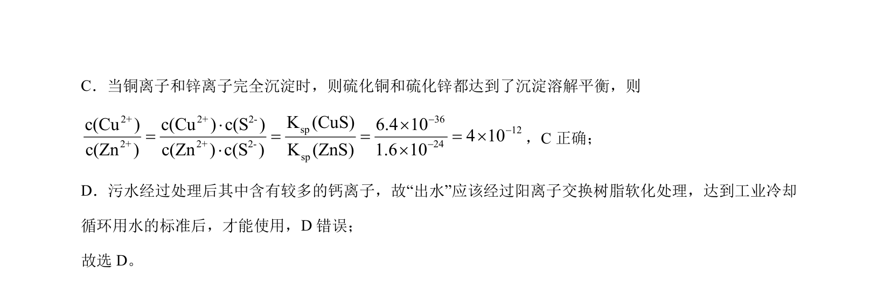

## 题面

## 摘要

该题考查颜料雌黄(As₂S₃)在空气湿度和光照下褪色的反应,涉及物质空间结构和氧化还原分析。

## 关联考点

- [[物质空间结构]]
- [[162-氧化还原反应|氧化还原反应]]
- [[电子转移计算]]

## 答案与解析

> 📄 原 PDF 第 7 页：`素材/真题/湖南/2008-2024·（湖南）化学高考真题/2023年高考化学试卷（湖南）（解析卷）.pdf`

<!-- 题干文本-start -->
## 题干文本
9. 处理某铜冶金污水(含 32 23Cu Fe Zn Al++++、、、)的部分流程如下：
  
已知：①溶液中金属离子开始沉淀和完全沉淀的pH如下表所示：
物质 3Fe O H2Cu OH2Zn OH3Al OH
开始沉淀pH1.9 4.2 6.2 3.5
完全沉淀pH3.2 6.7 8.2 4.6
②36 24sppsK CuS 6.4 10 , K ZnS 1.6 10- -= ´ = ´。
下列说法错误的是
A. “沉渣Ⅰ”中含有 3Fe(OH)和 3Al(OH)
B. 2Na S溶液呈碱性，其主要原因是22S H O HS OH- - -+ +ƒ
C. “沉淀池Ⅱ”中，当2Cu+和2Zn+完全沉淀时，溶液中
2122c Cu4.0 10c Zn+-+= ´
D. “出水”经阴离子交换树脂软化处理后，可用作工业冷却循环用水
<!-- 题干文本-end -->

<!-- 解析文本-start -->
## 解析文本
【答案】D
【解析】
【分析】污水中含有铜离子、三价铁离子、锌离子、铝离子，首先加入石灰乳除掉三价铁离子和铝离子，
过滤后，加入硫化钠除去其中的铜离子和锌离子，再次过滤后即可达到除去其中的杂质，以此解题。
【详解】A．根据分析可知氢氧化铁当 pH=1.9 时开始沉淀，氢氧化铝当 pH=3.5 时开始沉淀，当 pH=4 时，
则会生成氢氧化铝和氢氧化铁，即“沉渣 I”中含有 Fe(OH)3和 Al(OH)3，A 正确；
B．硫化钠溶液中的硫离子可以水解，产生氢氧根离子，使溶液显碱性，其第一步水解的方程式为： S2-
+H2O⇌HS-+OH-，B正确；
<!-- 解析文本-end -->
