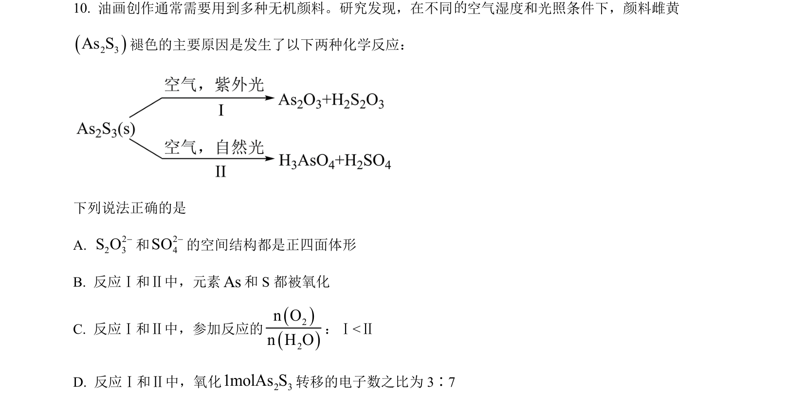
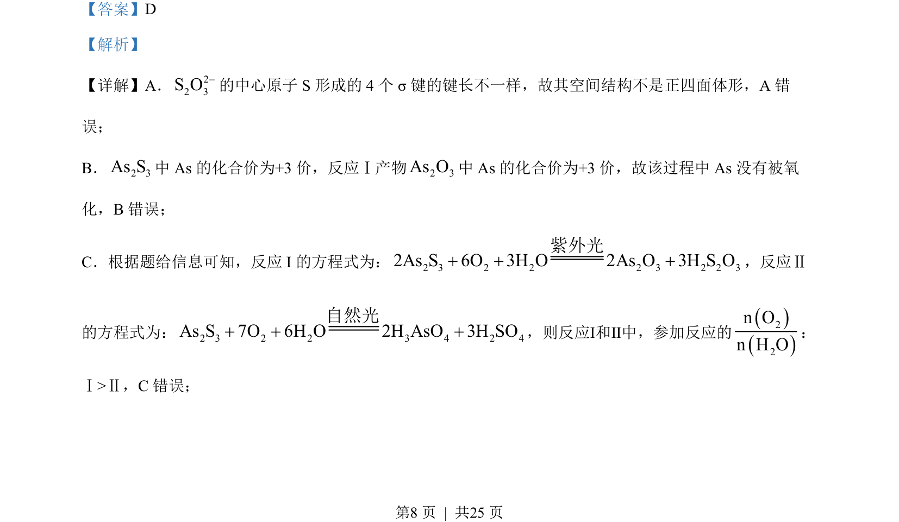
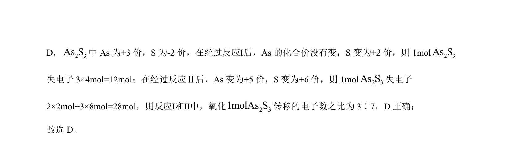

## 题面

## 摘要

（待补）

## 关联考点

## 答案与解析

> 📄 原 PDF 第 8 页：`素材/真题/湖南/2008-2024·（湖南）化学高考真题/2023年高考化学试卷（湖南）（解析卷）.pdf`

<!-- 题干文本-start -->
## 题干文本
10. 油画创作通常需要用到多种无机颜料。研究发现，在不同 空气湿度和光照条件下，颜料雌黄
23AsS褪色的主要原因是发生了以下两种化学反应：
  
下列说法正确的是
A. 22 3S O-和24SO-的空间结构都是正四面体形
B. 反应Ⅰ和Ⅱ中，元素As和 S 都被氧化
C. 反应Ⅰ和Ⅱ中，参加反应的
22n On H O：Ⅰ<Ⅱ
D. 反应Ⅰ和Ⅱ中，氧化 2 31molAs S转移的电子数之比为 3∶7
<!-- 题干文本-end -->

<!-- 解析文本-start -->
## 解析文本
【答案】D
【解析】
【详解】A．22 3S O-的中心原子 S 形成的 4 个 σ 键的键长不一样，故其空间结构不是正四面体形，A 错
误；
B．2 3As S中 As 的化合价为+3价，反应Ⅰ产物2 3As O中 As 的化合价为+3价，故该过程中 As 没有被氧
化，B错误；
C．根据题给信息可知，反应 I 的方程式为：2 3 2 2 2 3 2 2 32As S 6O 3H O 2As O 3H S O+ + +紫外光
，反应Ⅱ
的方程式为：2 3 2 2 3 4 2 4As S 7O 6H O 2H AsO 3H SO+ + +自然光
，则反应Ⅰ和Ⅱ中，参加反应的
22n On H O：
Ⅰ>Ⅱ，C错误；
的
<!-- 解析文本-end -->
