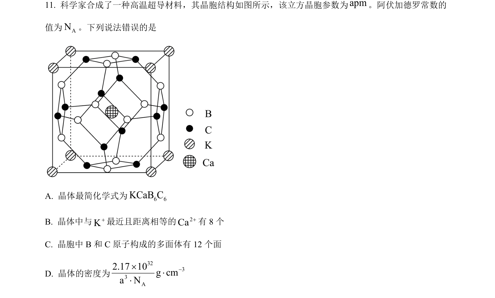
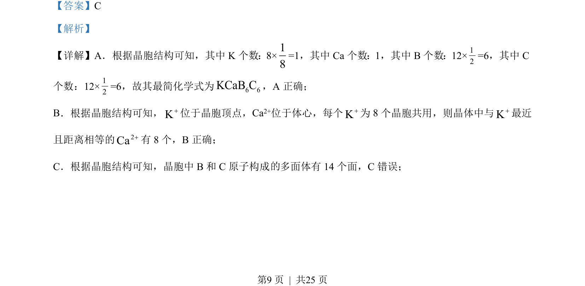
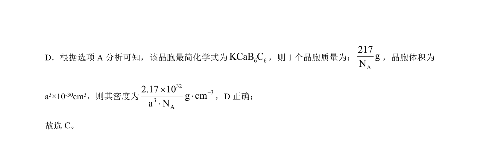

## 题面

## 摘要

考查晶胞化学式、离子配位数及密度计算，以及酸碱滴定中Ka计算与离子浓度大小比较

## 关联考点

- [[702-晶胞计算|晶胞计算]]
- [[晶体密度]]
- [[854-酸碱滴定|酸碱滴定]]
- [[333-电离常数|电离常数]]

## 答案与解析

> 📄 原 PDF 第 9 页：`素材/真题/湖南/2008-2024·（湖南）化学高考真题/2023年高考化学试卷（湖南）（解析卷）.pdf`
