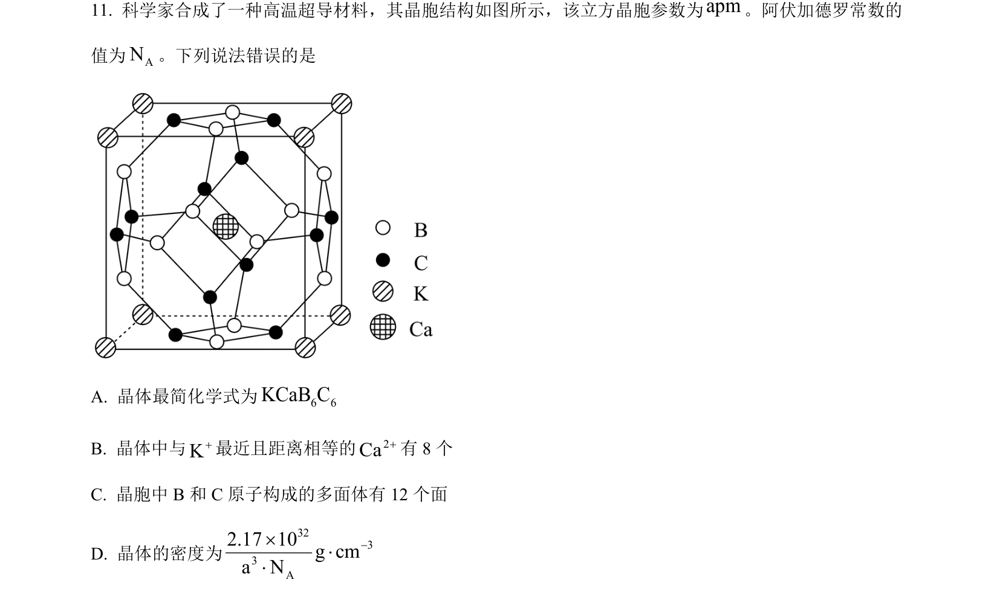
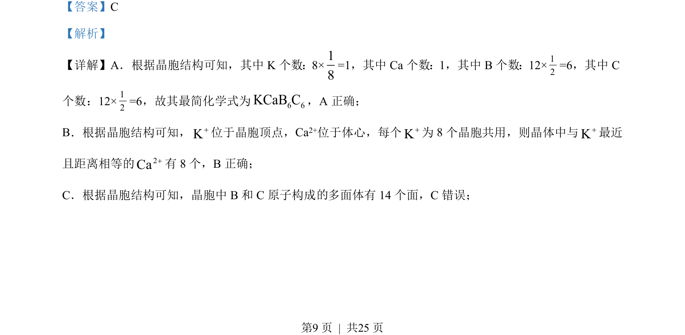
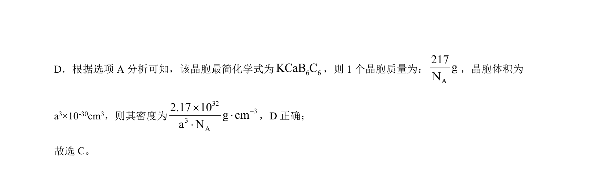

## 题面

## 摘要

考查晶胞化学式、离子配位数及密度计算，以及酸碱滴定中Ka计算与离子浓度大小比较

## 关联考点

- [[702-晶胞计算|晶胞计算]]
- [[晶体密度]]
- [[854-酸碱滴定|酸碱滴定]]
- [[333-电离常数|电离常数]]

## 答案与解析

> 📄 原 PDF 第 9 页：`素材/真题/湖南/2008-2024·（湖南）化学高考真题/2023年高考化学试卷（湖南）（解析卷）.pdf`

<!-- 题干文本-start -->
## 题干文本
11. 科学家合成了一种高温超导材料，其晶胞结构如图所示，该立方晶胞参数为apm。阿伏加德罗常数的
值为AN。下列说法错误的是
  
A. 晶体最简化学式为 6 6KCaB C
B. 晶体中与K+最近且距离相等的2Ca+有 8 个
C. 晶胞中 B和 C原子构成的多面体有 12 个面
D. 晶体的密度为
3233A2.17 10g cma N-´××
<!-- 题干文本-end -->

<!-- 解析文本-start -->
## 解析文本
【答案】C
【解析】
【详解】A．根据晶胞结构可知，其中 K 个数：8×18
=1，其中 Ca个数：1，其中 B个数：12×12=6，其中 C
个数：12×12=6，故其最简化学式为 6 6KCaB C，A 正确；
B．根据晶胞结构可知，K+位于晶胞顶点，Ca2+位于体心，每个K+为 8 个晶胞共用，则晶体中与K+最近
且距离相等的2Ca+有 8 个，B正确；
C．根据晶胞结构可知，晶胞中 B和 C原子构成 多面体有 14 个面，C错误；
的
<!-- 解析文本-end -->
