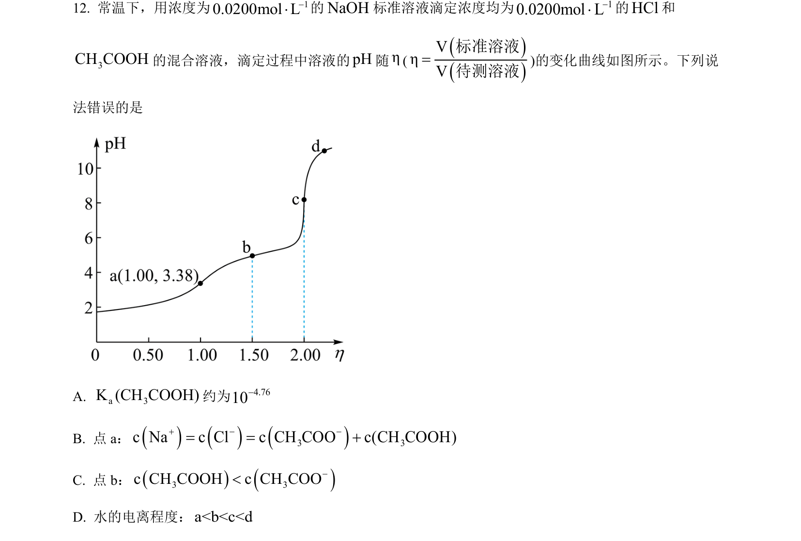
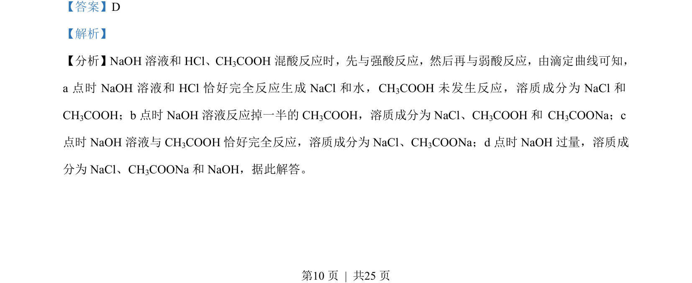
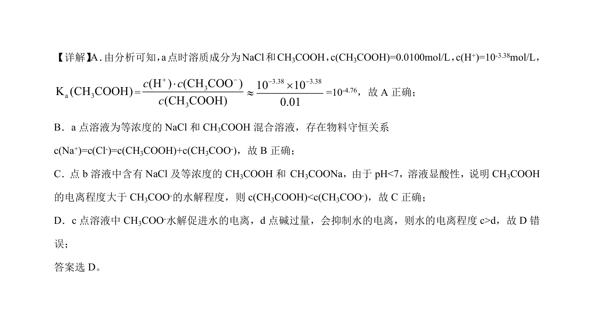

## 题面

## 摘要

NaOH滴定HCl和CH₃COOH混合酸的过程分析及电离平衡计算

## 关联考点

- [[340-酸碱中和滴定|酸碱中和滴定]]
- [[685-弱酸电离平衡|弱酸电离平衡]]
- [[电离常数计算]]
- [[772-物料守恒|物料守恒]]

## 答案与解析

> 📄 原 PDF 第 10 页：`素材/真题/湖南/2008-2024·（湖南）化学高考真题/2023年高考化学试卷（湖南）（解析卷）.pdf`
