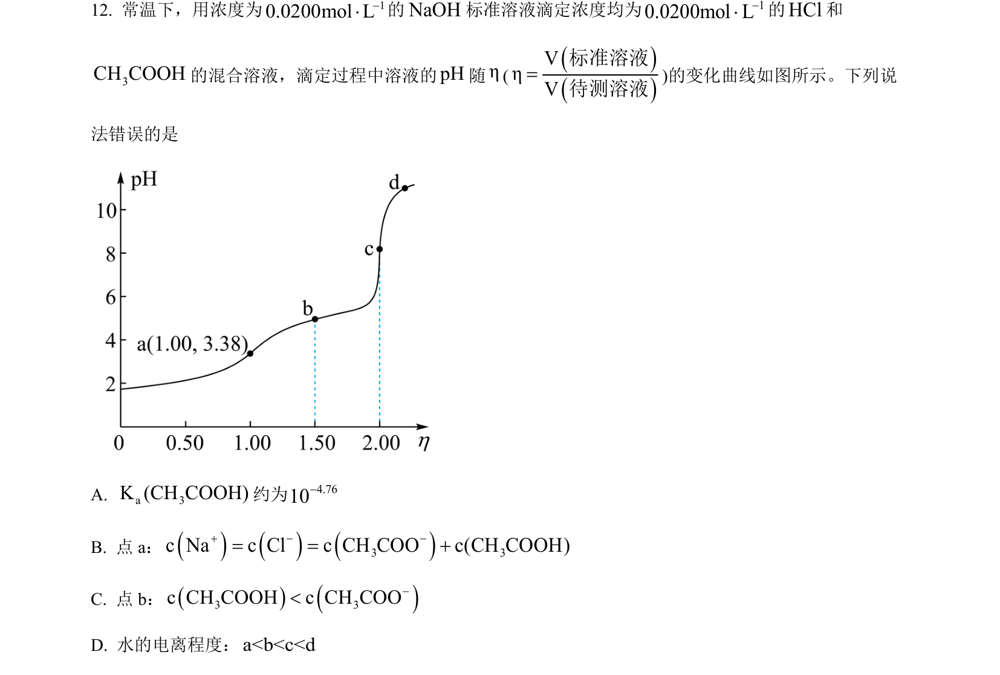
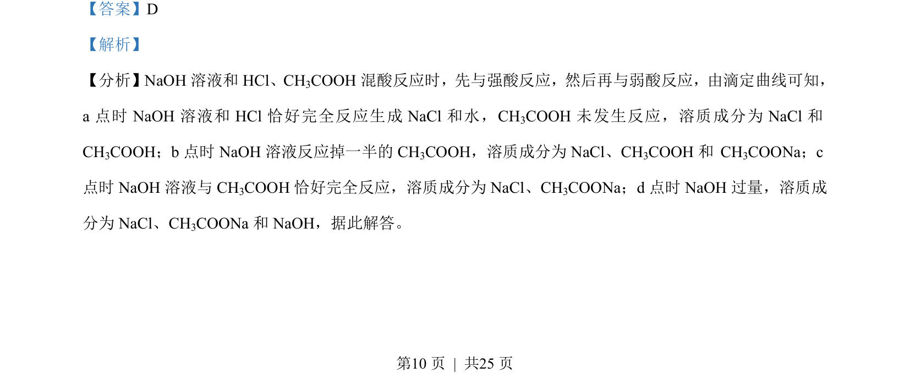
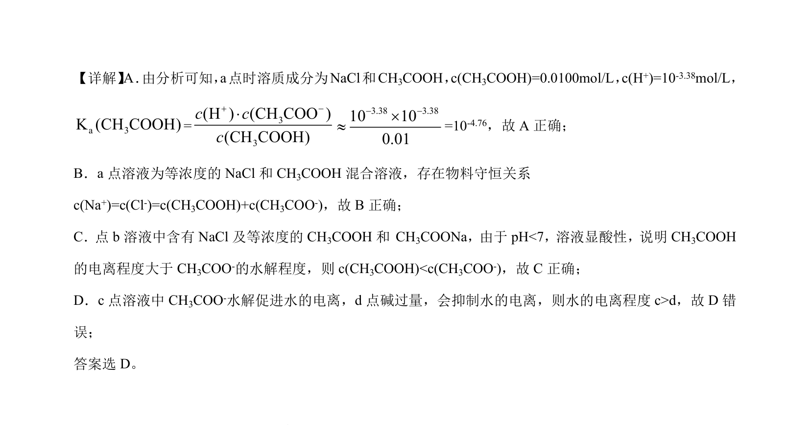

## 题面

## 摘要

NaOH滴定HCl和CH₃COOH混合酸的过程分析及电离平衡计算

## 关联考点

- [[340-酸碱中和滴定|酸碱中和滴定]]
- [[685-弱酸电离平衡|弱酸电离平衡]]
- [[电离常数计算]]
- [[772-物料守恒|物料守恒]]

## 答案与解析

> 📄 原 PDF 第 10 页：`素材/真题/湖南/2008-2024·（湖南）化学高考真题/2023年高考化学试卷（湖南）（解析卷）.pdf`

<!-- 题干文本-start -->
## 题干文本
12. 常温下，用浓度为 10.0200mol L-×的NaOH标准溶液滴定浓度均为 10.0200mol L-×的HCl和
3CH COOH的混合溶液，滴定过程中溶液的pH随η(
VηV=标准溶液待测溶液
)的变化曲线如图所示。下列说
法错误的是
  
A. a 3K CH C(OOH)约为4.7610-
B. 点 a：3 3c Na c Cl c CH COO c(CH COOH)+- -= = +
C. 点 b：3 3c CH COOH c CH COO-<
D. 水的电离程度：a<b<c<d
<!-- 题干文本-end -->

<!-- 解析文本-start -->
## 解析文本
【答案】D
【解析】
【分析】NaOH 溶液和 HCl、CH3COOH 混酸反应时，先与强酸反应，然后再与弱酸反应，由滴定曲线可知，
a 点时 NaOH 溶液和 HCl 恰好完全反应生成 NaCl 和水， CH3COOH 未发生反应，溶质成分为 NaCl 和
CH3COOH；b点时 NaOH 溶液反应掉一半的 CH3COOH，溶质成分为 NaCl、CH3COOH 和 CH 3COONa；c
点时 NaOH 溶液与 CH3COOH 恰好完全反应，溶质成分为 NaCl、CH3COONa；d 点时 NaOH 过量，溶质成
分为 NaCl、CH3COONa 和 NaOH，据此解答。
<!-- 解析文本-end -->
