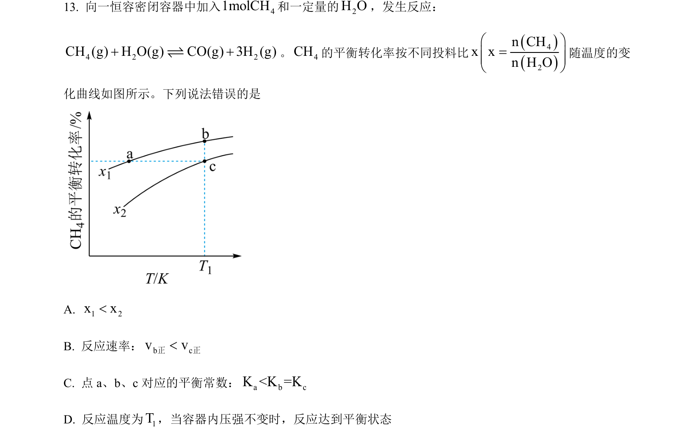
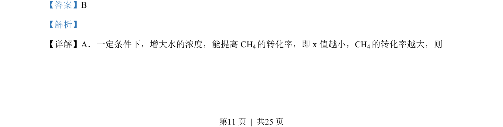
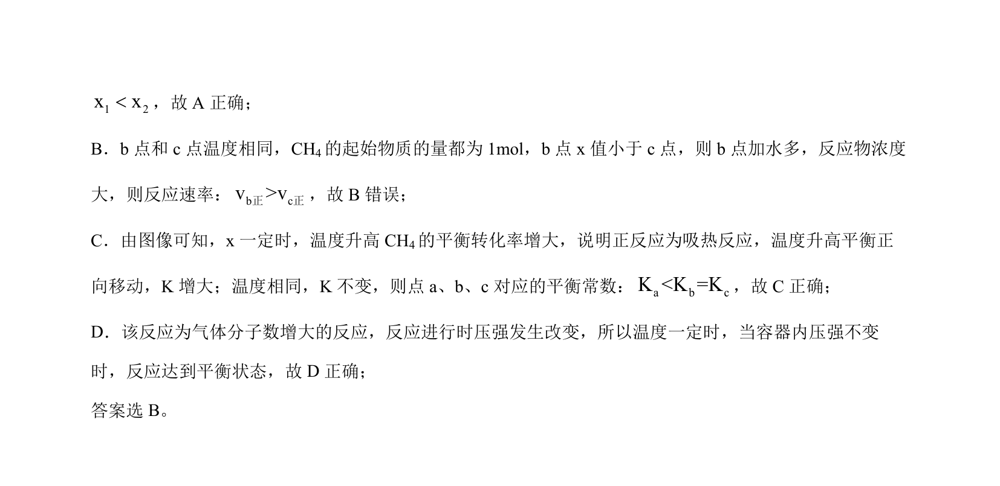

## 题面

## 摘要

本题考查电催化氧化NH₃合成N₂H₄的反应机理分析，涉及化合价、化学键及总反应判断。

## 关联考点

- [[028-化合价|化合价]]
- [[270-非极性共价键|非极性键]]
- [[氧化还原方程式]]
- [[644-反应机理|反应机理]]

## 答案与解析

> 📄 原 PDF 第 11 页：`素材/真题/湖南/2008-2024·（湖南）化学高考真题/2023年高考化学试卷（湖南）（解析卷）.pdf`
