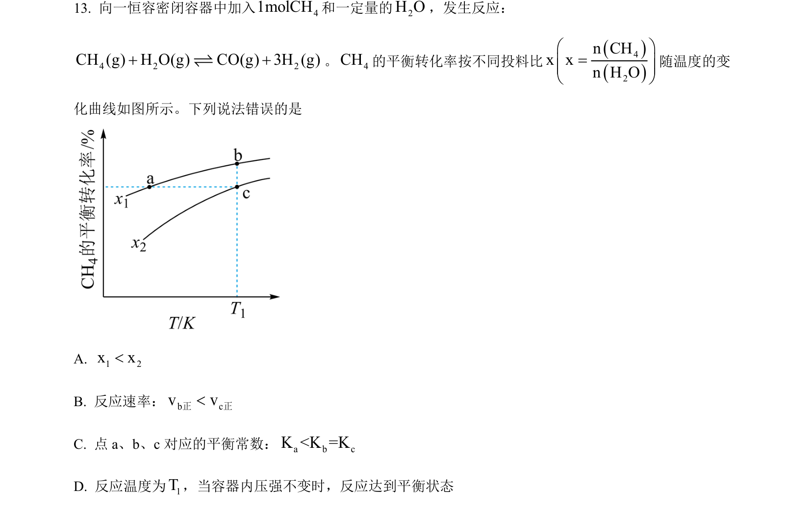
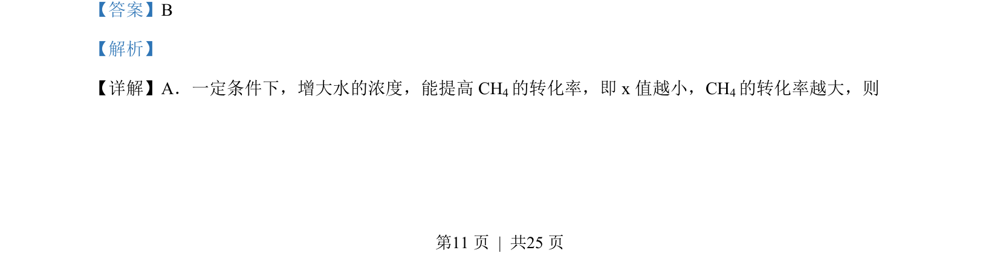
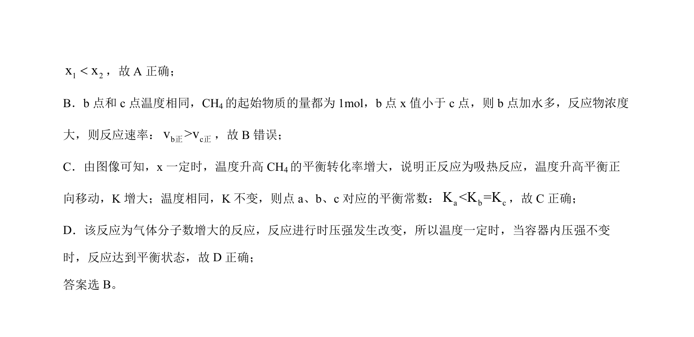

## 题面

## 摘要

本题考查电催化氧化NH₃合成N₂H₄的反应机理分析，涉及化合价、化学键及总反应判断。

## 关联考点

- [[028-化合价|化合价]]
- [[270-非极性共价键|非极性键]]
- [[氧化还原方程式]]
- [[644-反应机理|反应机理]]

## 答案与解析

> 📄 原 PDF 第 11 页：`素材/真题/湖南/2008-2024·（湖南）化学高考真题/2023年高考化学试卷（湖南）（解析卷）.pdf`

<!-- 题干文本-start -->
## 题干文本
13. 向一恒容密闭容器中加入 41molCH和一定量的2H O，发生反应：
4 2 2CH (g) H O(g) CO(g) 3H (g)+ +ƒ。4CH的平衡转化率按不同投料比
42n CHx xn H Oæ ö=ç ÷ç ÷è ø
随温度的变
化曲线如图所示。下列说法错误的是
A. 1 2x x<
B. 反应速率：b cv v<正正
C. 点 a、b、c对应的平衡常数：a b cK <K =K
D. 反应温度为1T，当容器内压强不变时，反应达到平衡状态
<!-- 题干文本-end -->

<!-- 解析文本-start -->
## 解析文本
【答案】B
【解析】
【详解】A．一定条件下，增大水的浓度，能提高 CH4的转化率，即 x 值越小，CH4的转化率越大，则
<!-- 解析文本-end -->
