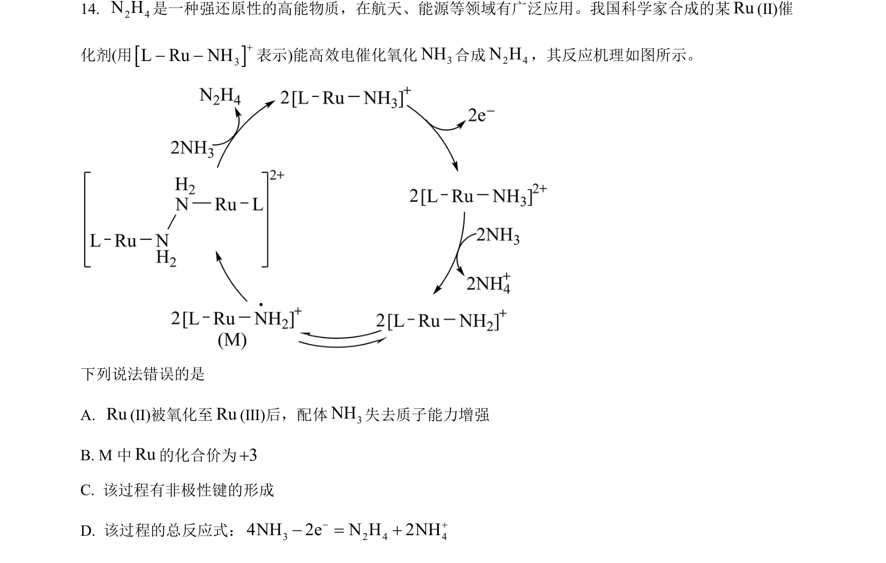
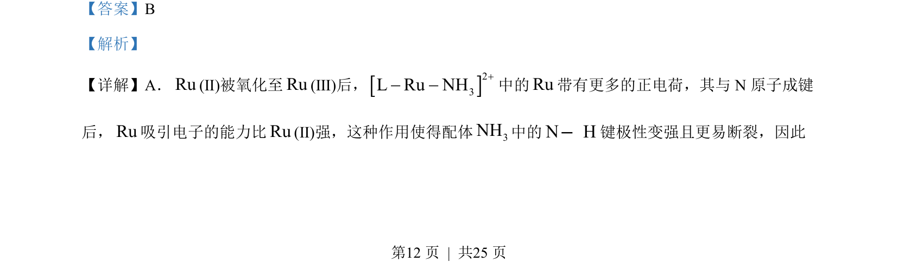
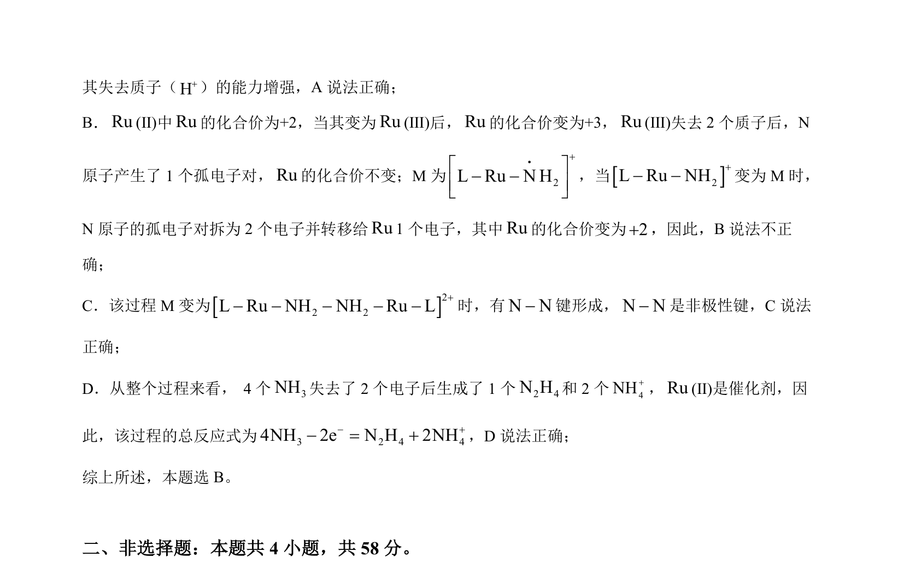

## 题面

## 摘要

分析Ru配合物中氧化态变化对N-H键极性、化合价及N-N键形成的影响，判断说法正误。

## 关联考点

- [[441-配合物|配合物]]
- [[162-氧化还原反应|氧化还原反应]]
- [[028-化合价|化合价]]
- [[化学键极性]]

## 答案与解析

> 📄 原 PDF 第 12 页：`素材/真题/湖南/2008-2024·（湖南）化学高考真题/2023年高考化学试卷（湖南）（解析卷）.pdf`
