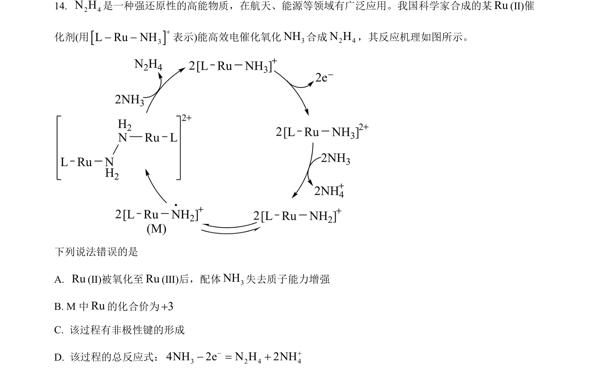
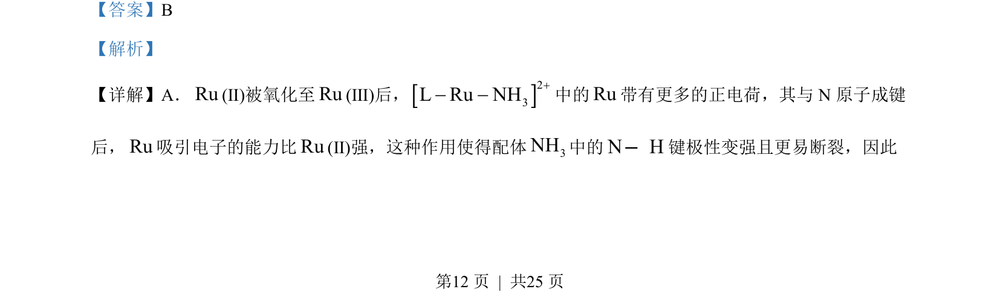
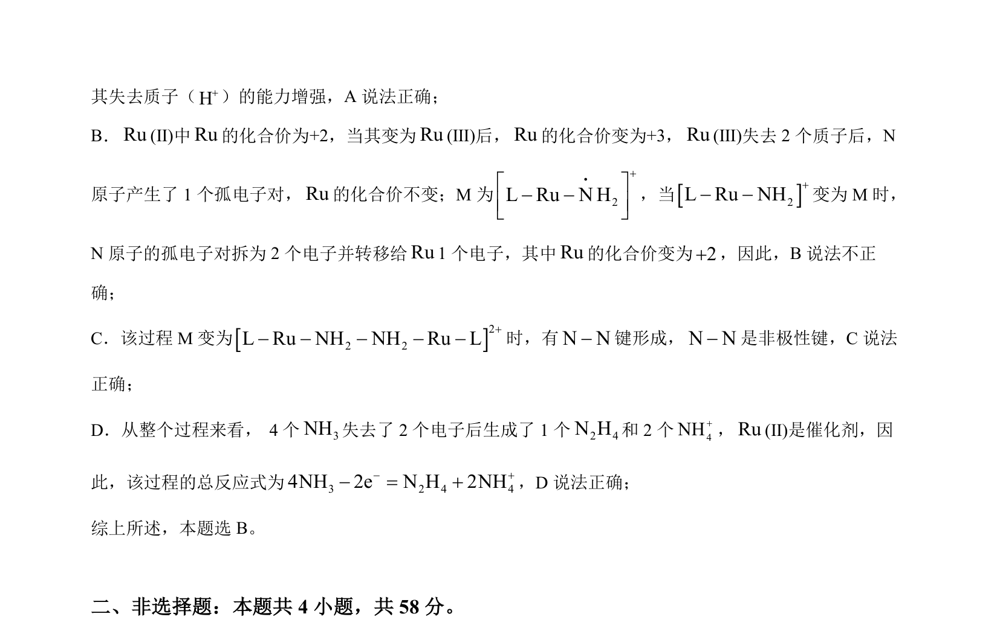

## 题面

## 摘要

分析Ru配合物中氧化态变化对N-H键极性、化合价及N-N键形成的影响，判断说法正误。

## 关联考点

- [[441-配合物|配合物]]
- [[162-氧化还原反应|氧化还原反应]]
- [[028-化合价|化合价]]
- [[化学键极性]]

## 答案与解析

> 📄 原 PDF 第 12 页：`素材/真题/湖南/2008-2024·（湖南）化学高考真题/2023年高考化学试卷（湖南）（解析卷）.pdf`

<!-- 题干文本-start -->
## 题干文本
14. 2 4N H是一种强还原性的高能物质，在航天、能源等领域有广泛应用。我国科学家合成的某Ru(Ⅱ)催
化剂(用3L Ru NH+- -表示)能高效电催化氧化3NH合成2 4N H，其反应机理如图所示。
  
下列说法错误的是
A. Ru(Ⅱ)被氧化至Ru(Ⅲ)后，配体3NH失去质子能力增强
B. M 中Ru的化合价为3+
C. 该过程有非极性键的形成
D. 该过程的总反应式：3 2 4 44NH 2e N H 2NH- +- = +
<!-- 题干文本-end -->

<!-- 解析文本-start -->
## 解析文本
【答案】B
【解析】
【详解】A．Ru(Ⅱ)被氧化至Ru(Ⅲ)后，23L Ru NH+- -中的Ru带有更多的正电荷，其与 N 原子成键
后，Ru吸引电子的能力比Ru(Ⅱ)强，这种作用使得配体3NH中的N H—键极性变强且更易断裂，因此
<!-- 解析文本-end -->
