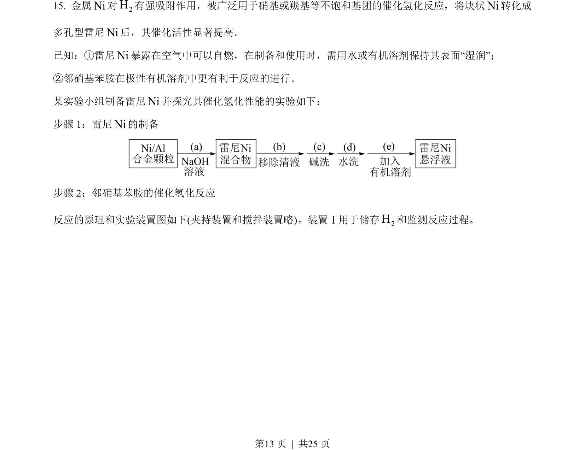
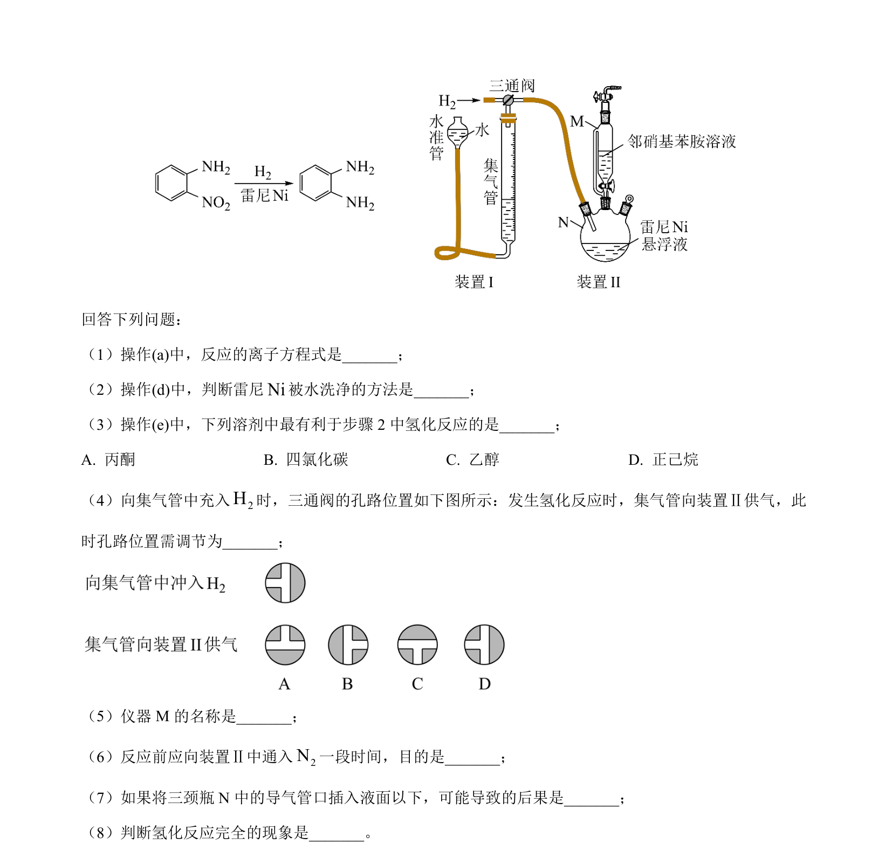
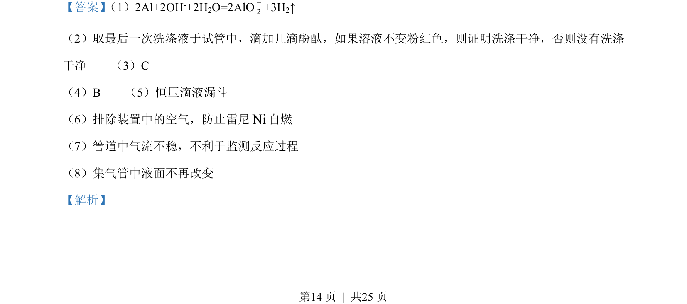
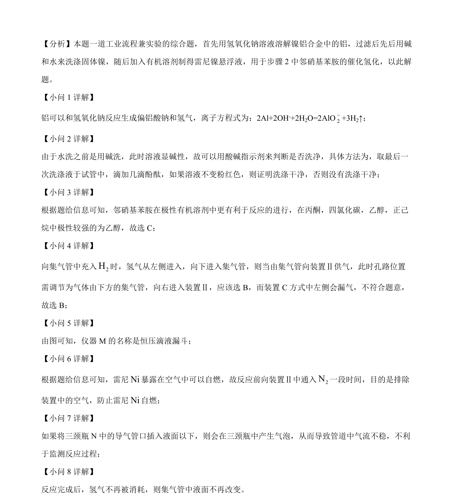

## 题面

## 摘要

工业流程与实验综合，涉及铝碱反应、洗涤检验、溶剂选择及催化氢化操作。

## 关联考点

- [[806-离子方程式书写|离子方程式书写]]
- [[沉淀洗涤检验]]
- [[有机溶剂极性]]
- [[实验装置连接与操作]]
- [[仪器名称]]
- [[防氧化安全措施]]

## 答案与解析

> 📄 原 PDF 第 13 页：`素材/真题/湖南/2008-2024·（湖南）化学高考真题/2023年高考化学试卷（湖南）（解析卷）.pdf`
