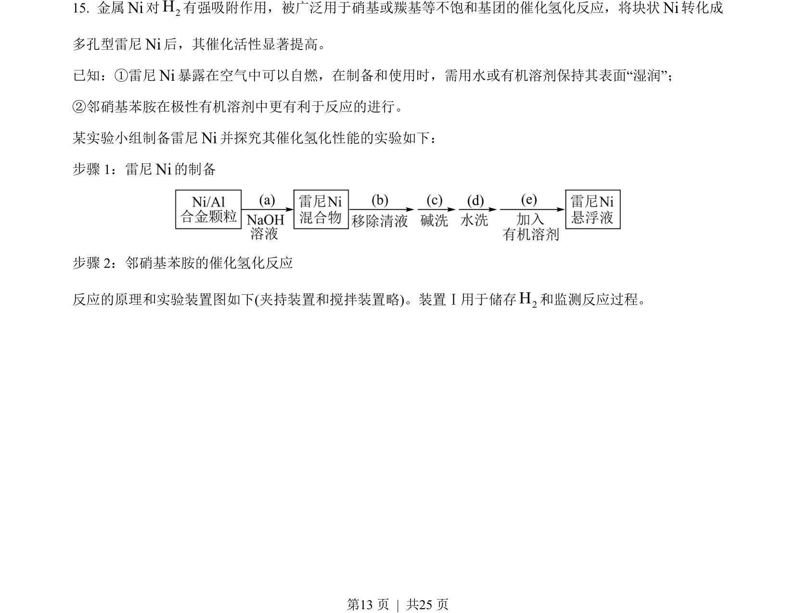
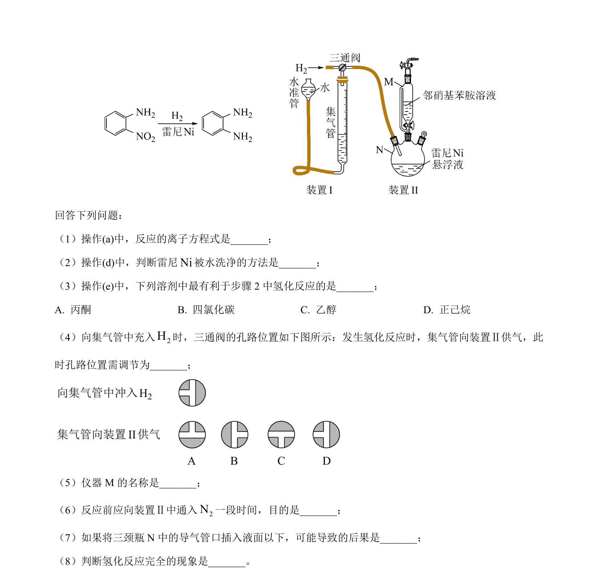
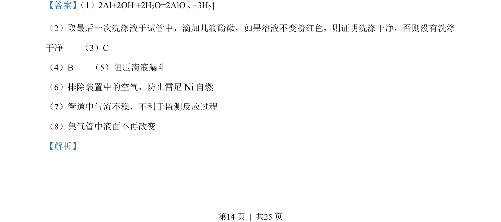
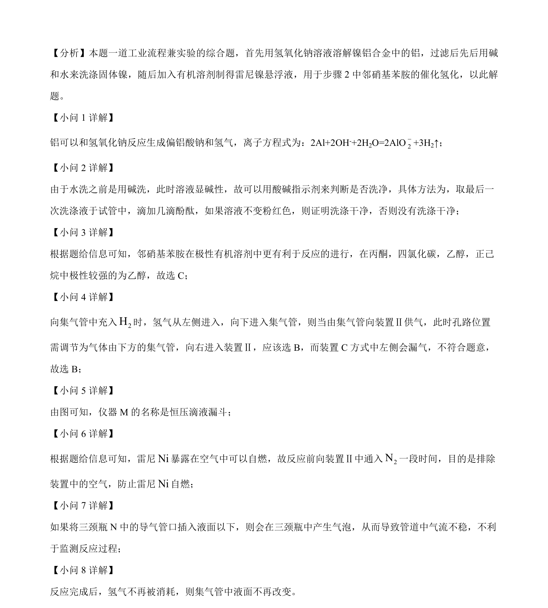

## 题面

## 摘要

工业流程与实验综合，涉及铝碱反应、洗涤检验、溶剂选择及催化氢化操作。

## 关联考点

- [[807-离子方程式的书写|离子方程式书写]]
- [[沉淀洗涤检验]]
- [[有机溶剂极性]]
- [[实验装置连接与操作]]
- [[仪器名称]]
- [[防氧化安全措施]]

## 答案与解析

> 📄 原 PDF 第 13 页：`素材/真题/湖南/2008-2024·（湖南）化学高考真题/2023年高考化学试卷（湖南）（解析卷）.pdf`

<!-- 题干文本-start -->
## 题干文本
15. 金属Ni对2H有强吸附作用，被广泛用于硝基或羰基等不饱和基团的催化氢化反应，将块状Ni转化成
多孔型雷尼Ni后，其催化活性显著提高。
已知：①雷尼Ni暴露在空气中可以自燃，在制备和使用时，需用水或有机溶剂保持其表面“湿润”；
②邻硝基苯胺在极性有机溶剂中更有利于反应的进行。
某实验小组制备雷尼Ni并探究其催化氢化性能的实验如下：
步骤 1：雷尼Ni的制备
步骤 2：邻硝基苯胺的催化氢化反应
反应的原理和实验装置图如下(夹持装置和搅拌装置略)。装置Ⅰ用于储存2H和监测反应过程。
<!-- 题干文本-end -->

<!-- 解析文本-start -->
## 解析文本

<!-- 解析文本-end -->
