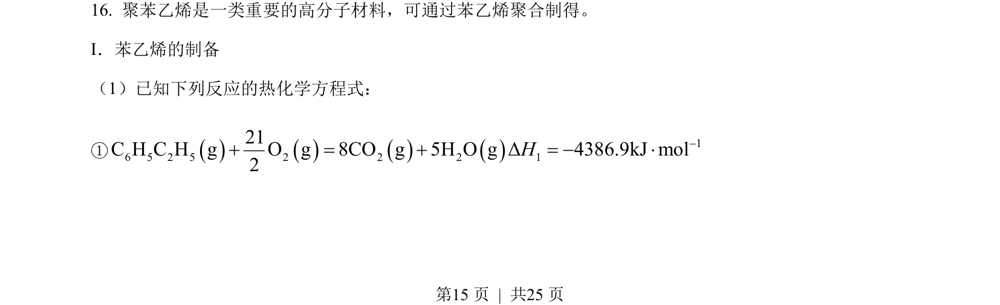
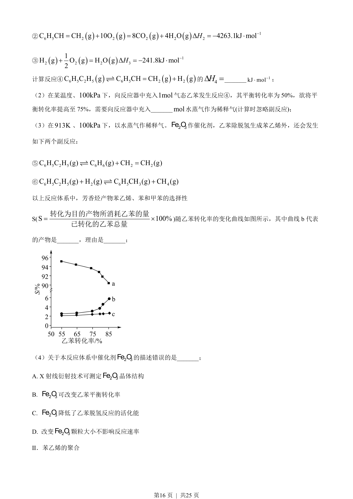
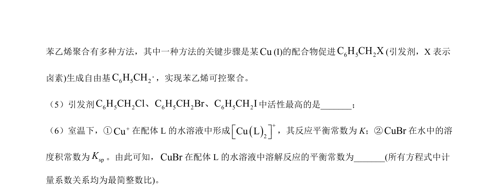
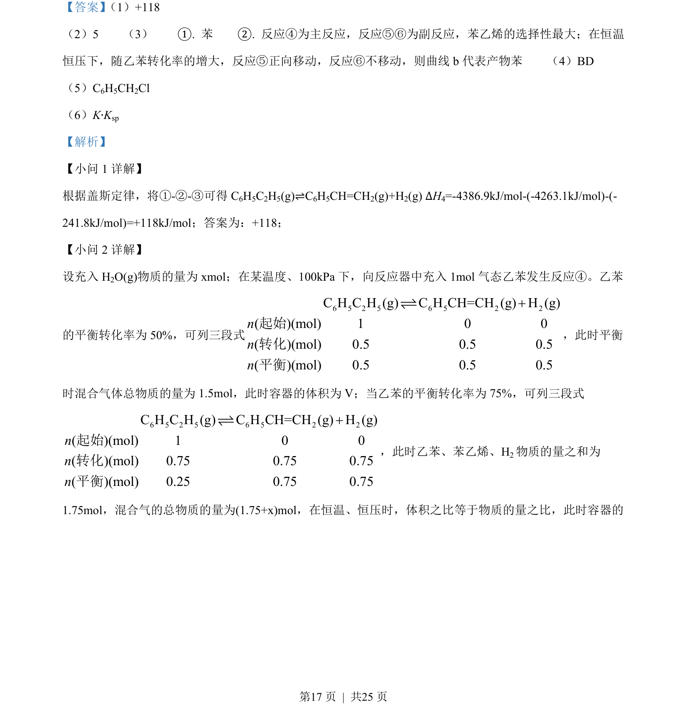
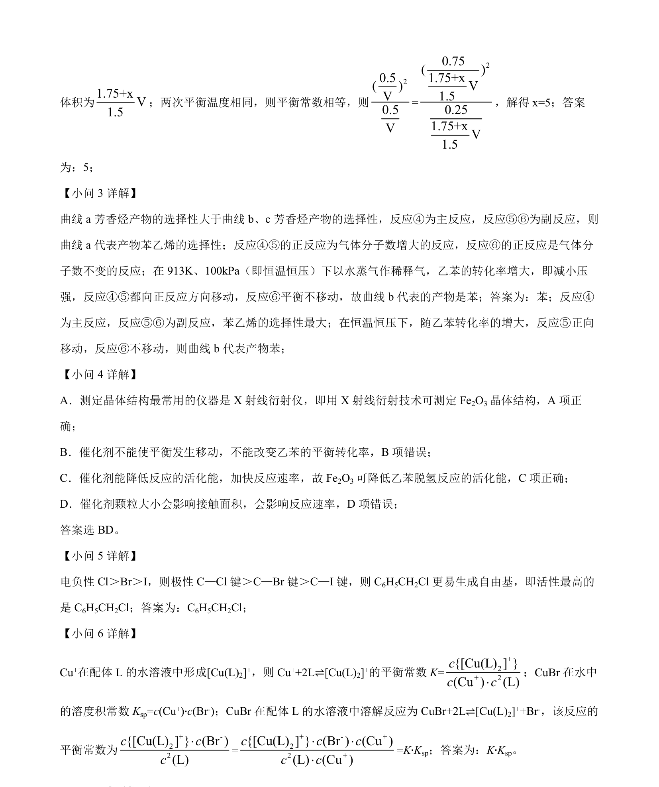

## 题面

## 摘要

考查盖斯定律计算反应热，以及利用三段式进行化学平衡转化率的相关计算

## 关联考点

- [[311-盖斯定律|盖斯定律]]
- [[284-化学平衡|化学平衡]]
- [[三段式计算]]
- [[356-转化率|转化率]]

## 答案与解析

> 📄 原 PDF 第 15 页：`素材/真题/湖南/2008-2024·（湖南）化学高考真题/2023年高考化学试卷（湖南）（解析卷）.pdf`
