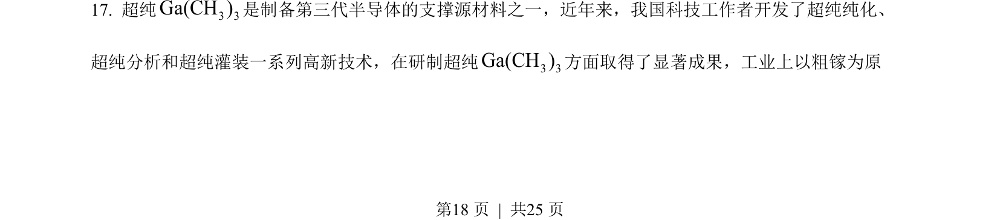
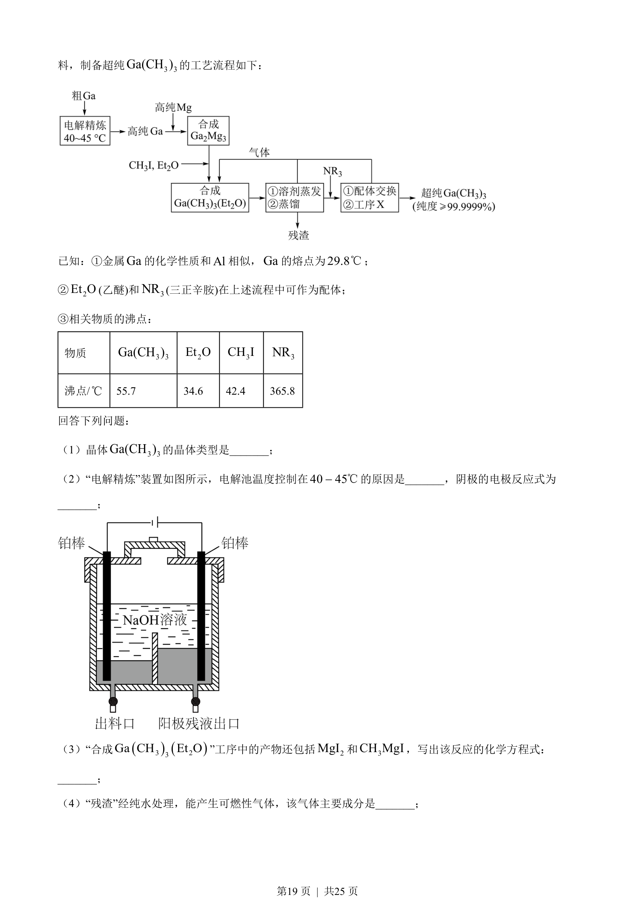
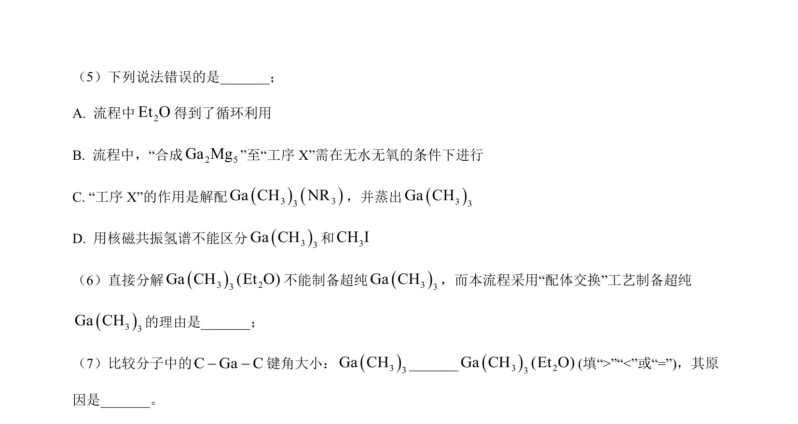
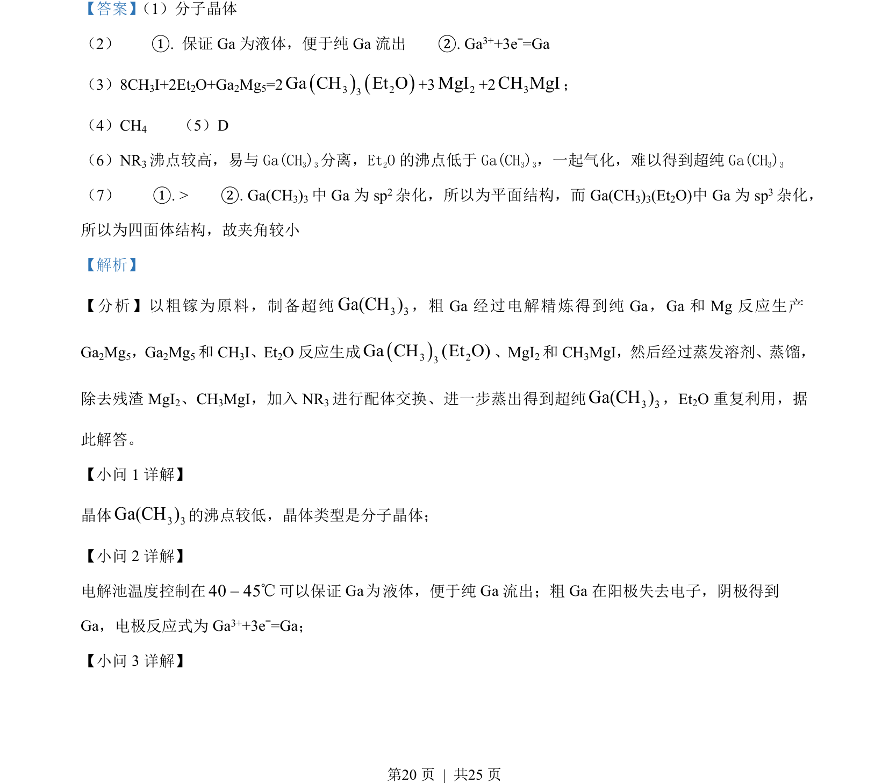
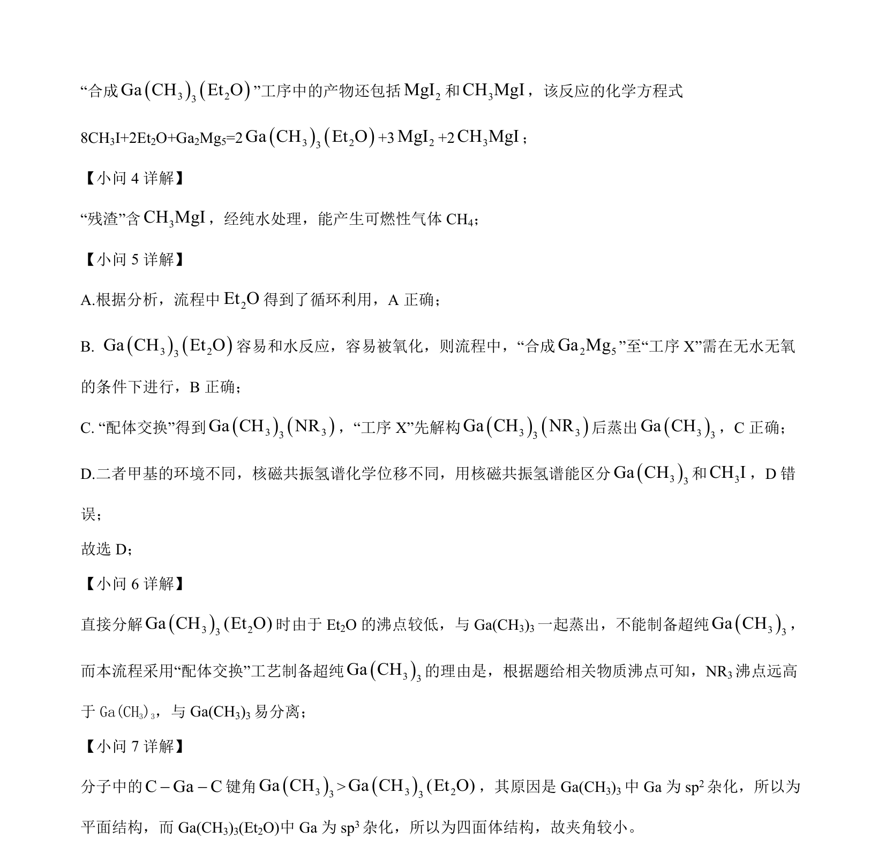

## 题面

## 摘要

该题考查粗镓电解精炼及Ga(CH₃)₃的制备流程，涉及晶体类型、电极反应和化学方程式书写。

## 关联考点

- [[407-分子晶体|分子晶体]]
- [[370-电解精炼|电解精炼]]
- [[794-电极反应式|电极反应式]]
- [[621-化学方程式书写|化学方程式书写]]

## 答案与解析

> 📄 原 PDF 第 18 页：`素材/真题/湖南/2008-2024·（湖南）化学高考真题/2023年高考化学试卷（湖南）（解析卷）.pdf`
