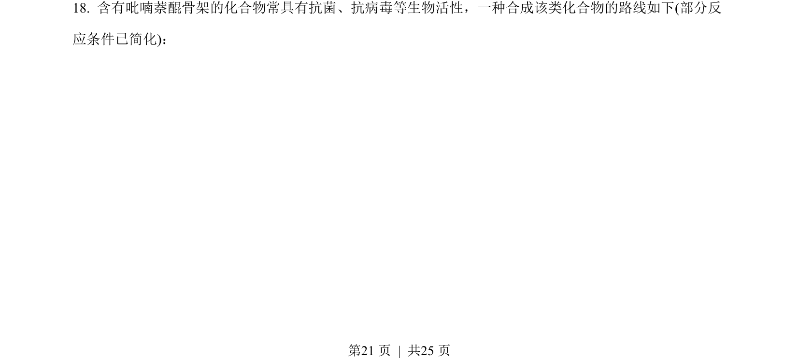
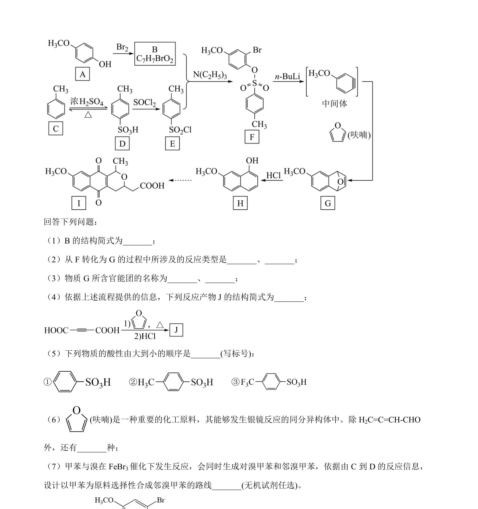
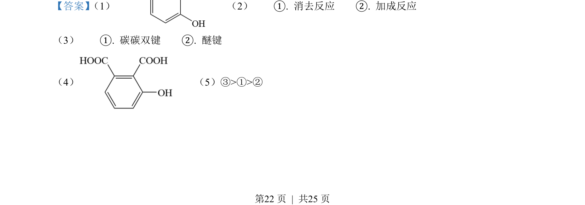
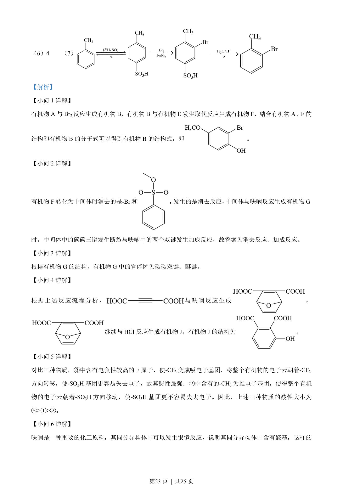
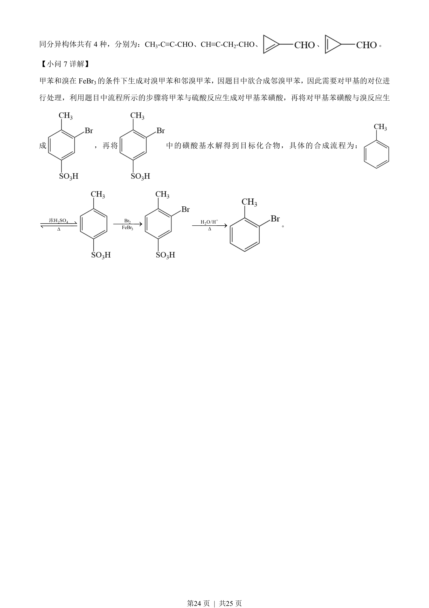

## 题面

## 摘要

本题为有机合成路线题，考查结构推断、反应类型、官能团识别、酸性比较及同分异构体书写。

## 关联考点

- [[271-化学合成|有机合成]]
- [[647-反应类型判断|反应类型判断]]
- [[448-官能团|官能团]]
- [[852-酸性比较|酸性比较]]
- [[446-同分异构体|同分异构体]]

## 答案与解析

> 📄 原 PDF 第 21 页：`素材/真题/湖南/2008-2024·（湖南）化学高考真题/2023年高考化学试卷（湖南）（解析卷）.pdf`
