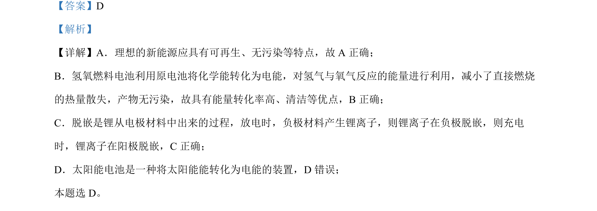

## 题面

## 摘要

本题考查新能源特点、燃料电池工作原理及二次电池脱嵌过程，辨析太阳能电池能量转化形式。

## 关联考点

- [[012-新能源|新能源]]
- [[285-化学电源|化学电源]]
- [[电化学脱嵌]]
- [[720-能量转化|能量转化]]

## 答案与解析

> 📄 原 PDF 第 1 页：`素材/真题/湖南/2008-2024·（湖南）化学高考真题/2024年高考化学试卷（湖南）（解析卷）.pdf`
