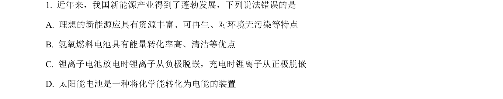
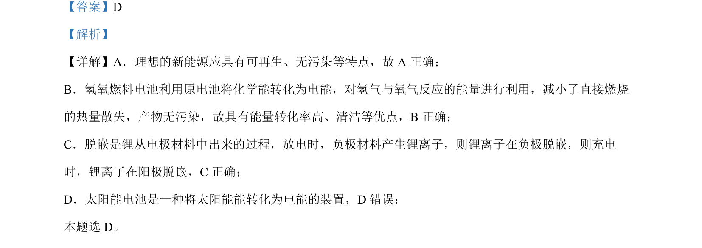

## 题面

## 摘要

本题考查新能源特点、燃料电池工作原理及二次电池脱嵌过程，辨析太阳能电池能量转化形式。

## 关联考点

- [[012-新能源|新能源]]
- [[285-化学电源|化学电源]]
- [[电化学脱嵌]]
- [[720-能量转化|能量转化]]

## 答案与解析

> 📄 原 PDF 第 1 页：`素材/真题/湖南/2008-2024·（湖南）化学高考真题/2024年高考化学试卷（湖南）（解析卷）.pdf`

<!-- 题干文本-start -->
## 题干文本
1. 近年来，我国新能源产业得到了蓬勃发展，下列说法错误的是
A. 理想的新能源应具有资源丰富、可再生、对环境无污染等特点
B. 氢氧燃料电池具有能量转化率高、清洁等优点
C. 锂离子电池放电时锂离子从负极脱嵌，充电时锂离子从正极脱嵌
D. 太阳能电池是一种将化学能转化为电能的装置
<!-- 题干文本-end -->

<!-- 解析文本-start -->
## 解析文本
【答案】D
【解析】
【详解】A．理想的新能源应具有可再生、无污染等特点，故 A 正确；
B．氢氧燃料电池利用原电池将化学能转化为电能，对氢气与氧气反应的能量进行利用，减小了直接燃烧
的热量散失，产物无污染，故具有能量转化率高、清洁等优点，B正确；
C．脱嵌是锂从电极材料中出来的过程，放电时，负极材料产生锂离子，则锂离子在负极脱嵌，则充电
时，锂离子在阳极脱嵌，C正确；
D．太阳能电池是一种将太阳能能转化为电能的装置，D 错误；
本题选 D。
<!-- 解析文本-end -->
